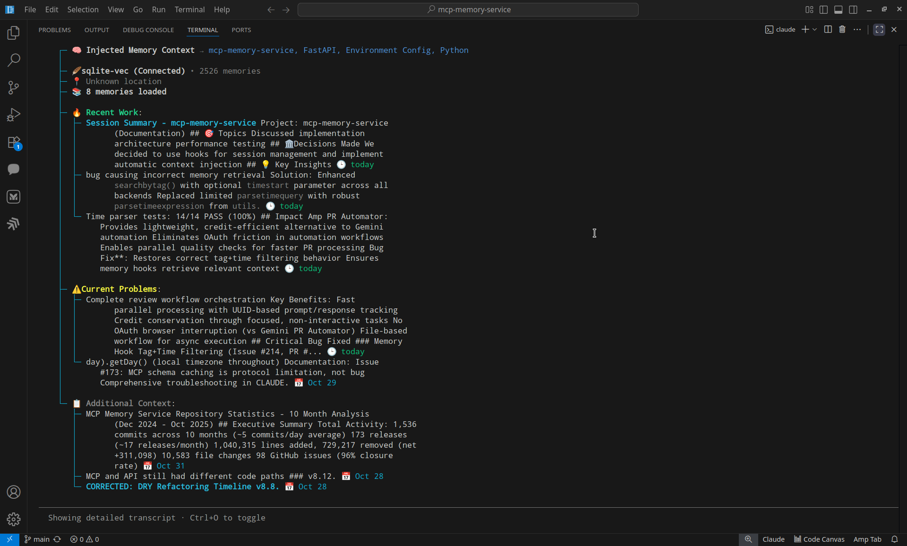

# MCP Memory Service

[](https://opensource.org/licenses/Apache-2.0)
[](https://pypi.org/project/mcp-memory-service/)
[](https://pypi.org/project/mcp-memory-service/)
[](https://github.com/doobidoo/mcp-memory-service/actions/workflows/main.yml)
[](https://pypi.org/project/mcp-memory-service/)
[](https://github.com/doobidoo/mcp-memory-service/commits/main)
[](https://github.com/doobidoo/mcp-memory-service/stargazers)
[](https://github.com/doobidoo/mcp-memory-service#-in-production)

[](https://claude.ai)
[](https://cursor.sh)
[](https://modelcontextprotocol.io/)
[](https://github.com/doobidoo/mcp-memory-service/wiki)
[](https://github.com/doobidoo/mcp-memory-service/pkgs/container/mcp-memory-service)
[](https://github.com/doobidoo/mcp-memory-service/issues)
[](https://deepwiki.com/doobidoo/mcp-memory-service)

**Production-ready MCP memory service** with **zero database locks**, **hybrid backend** (fast local + cloud sync), and **intelligent memory search** for **AI assistants**. Features **v8.9.0 auto-configuration** for multi-client access, **5ms local reads** with background Cloudflare sync, **Natural Memory Triggers** with 85%+ accuracy, and **OAuth 2.1 team collaboration**. Works with **Claude Desktop, VS Code, Cursor, Continue, and 13+ AI applications**.


## 🚀 Quick Start (2 minutes)

### 🆕 Latest Release: **v8.25.1** (Nov 16, 2025)

**Critical Bug Fixes** 🐛🔧

- 🔧 **Drift detection script fixed** - Corrected initialization errors in `check_drift.py` (PR #224)
- ✅ **CI test infrastructure improved** - HuggingFace model caching prevents network failures (PR #225)
- 🏗️ **Cloudflare backend initialization** - Fixed missing config parameters for hybrid storage
- 🧪 **Test stability** - Eliminated CI failures from model download restrictions

**Previous Releases**:
- **v8.25.0** - Hybrid Backend Drift Detection (automatic metadata sync, bidirectional awareness)
- **v8.24.4** - Code Quality Improvements from Gemini Code Assist (regex sanitization, DOM caching)
- **v8.24.3** - Test Coverage & Release Agent Improvements (tag+time filtering tests, version history fix)
- **v8.24.2** - CI/CD Workflow Fixes (bash errexit handling, exit code capture)
- **v8.24.1** - Test Infrastructure Improvements (27 test failures resolved, 63% → 71% pass rate)
- **v8.24.0** - PyPI Publishing Enabled (automated package publishing via GitHub Actions)
- **v8.23.1** - Stale Virtual Environment Prevention System (6-layer developer protection)
- **v8.23.0** - Consolidation Scheduler via Code Execution API (88% token reduction)
- **v8.22.3** - Complete tag schema validation fix (7 MCP tools updated)

**📖 Full Details**: [CHANGELOG.md](CHANGELOG.md#8222---2025-11-09) | [All Releases](https://github.com/doobidoo/mcp-memory-service/releases)

---

```bash
# One-command installation with auto-configuration
git clone https://github.com/doobidoo/mcp-memory-service.git
cd mcp-memory-service && python install.py

# Choose option 4 (Hybrid - RECOMMENDED) when prompted
# Installer automatically configures:
#   ✅ SQLite pragmas for concurrent access
#   ✅ Cloudflare credentials for cloud sync
#   ✅ Claude Desktop integration

# Done! Fast local + cloud sync with zero database locks
```

### PyPI Installation (Simplest)

**Install from PyPI:**
```bash
# Install latest version from PyPI
pip install mcp-memory-service

# Or with uv (faster)
uv pip install mcp-memory-service
```

**Then configure Claude Desktop** by adding to `~/Library/Application Support/Claude/claude_desktop_config.json` (macOS) or equivalent:
```json
{
  "mcpServers": {
    "memory": {
      "command": "memory",
      "args": ["server"],
      "env": {
        "MCP_MEMORY_STORAGE_BACKEND": "hybrid"
      }
    }
  }
}
```

For advanced configuration with the interactive installer, clone the repo and run `python scripts/installation/install.py`.

### Developer Setup (Contributing)

**For development and contributing**, use editable install to ensure source code changes take effect immediately:

```bash
# Clone repository
git clone https://github.com/doobidoo/mcp-memory-service.git
cd mcp-memory-service

# Create and activate virtual environment
python -m venv venv
source venv/bin/activate  # On Windows: venv\Scripts\activate

# CRITICAL: Editable install (code changes take effect immediately)
pip install -e .

# Verify editable mode (should show source directory, not site-packages)
pip show mcp-memory-service | grep Location
# Expected: Location: /path/to/mcp-memory-service/src

# Start development server
uv run memory server
```

**⚠️ Important**: Editable install (`-e` flag) ensures MCP servers load from source code, not stale `site-packages`. Without this, source changes won't be reflected until you reinstall the package.

**Version Mismatch Check:**
```bash
# Verify installed version matches source code
python scripts/validation/check_dev_setup.py
```

See [CLAUDE.md](CLAUDE.md#development-setup-critical) for complete development guidelines.

### Traditional Setup Options

**Universal Installer (Most Compatible):**
```bash
# Clone and install with automatic platform detection
git clone https://github.com/doobidoo/mcp-memory-service.git
cd mcp-memory-service

# Lightweight installation (SQLite-vec with ONNX embeddings - recommended)
python install.py

# Add full ML capabilities (torch + sentence-transformers for advanced features)
python install.py --with-ml

# Install with hybrid backend (SQLite-vec + Cloudflare sync)
python install.py --storage-backend hybrid
```

**📝 Installation Options Explained:**
- **Default (recommended)**: Lightweight SQLite-vec with ONNX embeddings - fast, works offline, <100MB dependencies
- **`--with-ml`**: Adds PyTorch + sentence-transformers for advanced ML features - heavier but more capable
- **`--storage-backend hybrid`**: Hybrid backend with SQLite-vec + Cloudflare sync - best for multi-device access

**Docker (Fastest):**
```bash
# For MCP protocol (Claude Desktop)
docker-compose up -d

# For HTTP API + OAuth (Team Collaboration)
docker-compose -f docker-compose.http.yml up -d
```

**Smithery (Claude Desktop):**
```bash
# Auto-install for Claude Desktop
npx -y @smithery/cli install @doobidoo/mcp-memory-service --client claude
```

## ⚠️ v6.17.0+ Script Migration Notice

**Updating from an older version?** Scripts have been reorganized for better maintainability:
- **Recommended**: Use `python -m mcp_memory_service.server` in your Claude Desktop config (no path dependencies!)
- **Alternative 1**: Use `uv run memory server` with UV tooling
- **Alternative 2**: Update path from `scripts/run_memory_server.py` to `scripts/server/run_memory_server.py`
- **Backward compatible**: Old path still works with a migration notice

## ⚠️ First-Time Setup Expectations

On your first run, you'll see some warnings that are **completely normal**:

- **"WARNING: Failed to load from cache: No snapshots directory"** - The service is checking for cached models (first-time setup)
- **"WARNING: Using TRANSFORMERS_CACHE is deprecated"** - Informational warning, doesn't affect functionality
- **Model download in progress** - The service automatically downloads a ~25MB embedding model (takes 1-2 minutes)

These warnings disappear after the first successful run. The service is working correctly! For details, see our [First-Time Setup Guide](docs/first-time-setup.md).

### 🐍 Python 3.13 Compatibility Note

**sqlite-vec** may not have pre-built wheels for Python 3.13 yet. If installation fails:
- The installer will automatically try multiple installation methods
- Consider using Python 3.12 for the smoothest experience: `brew install python@3.12`
- Alternative: Use Cloudflare backend with `--storage-backend cloudflare`
- See [Troubleshooting Guide](docs/troubleshooting/general.md#python-313-sqlite-vec-issues) for details

### 🍎 macOS SQLite Extension Support

**macOS users** may encounter `enable_load_extension` errors with sqlite-vec:
- **System Python** on macOS lacks SQLite extension support by default
- **Solution**: Use Homebrew Python: `brew install python && rehash`
- **Alternative**: Use pyenv: `PYTHON_CONFIGURE_OPTS='--enable-loadable-sqlite-extensions' pyenv install 3.12.0`
- **Fallback**: Use Cloudflare or Hybrid backend: `--storage-backend cloudflare` or `--storage-backend hybrid`
- See [Troubleshooting Guide](docs/troubleshooting/general.md#macos-sqlite-extension-issues) for details

## 🎯 Memory Awareness in Action

**Intelligent Context Injection** - See how the memory service automatically surfaces relevant information at session start:



**What you're seeing:**
- 🧠 **Automatic memory injection** - 8 relevant memories found from 2,526 total
- 📂 **Smart categorization** - Recent Work, Current Problems, Additional Context
- 📊 **Git-aware analysis** - Recent commits and keywords automatically extracted
- 🎯 **Relevance scoring** - Top memories scored at 100% (today), 89% (8d ago), 84% (today)
- ⚡ **Fast retrieval** - SQLite-vec backend with 5ms read performance
- 🔄 **Background sync** - Hybrid backend syncing to Cloudflare

**Result**: Claude starts every session with full project context - no manual prompting needed.

## 📚 Complete Documentation

**👉 Visit our comprehensive [Wiki](https://github.com/doobidoo/mcp-memory-service/wiki) for detailed guides:**

### 🧠 v7.1.3 Natural Memory Triggers (Latest)
- **[Natural Memory Triggers v7.1.3 Guide](https://github.com/doobidoo/mcp-memory-service/wiki/Natural-Memory-Triggers-v7.1.0)** - Intelligent automatic memory awareness
  - ✅ **85%+ trigger accuracy** with semantic pattern detection
  - ✅ **Multi-tier performance** (50ms instant → 150ms fast → 500ms intensive)
  - ✅ **CLI management system** for real-time configuration
  - ✅ **Git-aware context** integration for enhanced relevance
  - ✅ **Zero-restart installation** with dynamic hook loading

### 🆕 v7.0.0 OAuth & Team Collaboration
- **[🔐 OAuth 2.1 Setup Guide](https://github.com/doobidoo/mcp-memory-service/wiki/OAuth-2.1-Setup-Guide)** - **NEW!** Complete OAuth 2.1 Dynamic Client Registration guide
- **[🔗 Integration Guide](https://github.com/doobidoo/mcp-memory-service/wiki/03-Integration-Guide)** - Claude Desktop, **Claude Code HTTP transport**, VS Code, and more
- **[🛡️ Advanced Configuration](https://github.com/doobidoo/mcp-memory-service/wiki/04-Advanced-Configuration)** - **Updated!** OAuth security, enterprise features

### 🧬 v8.23.0+ Memory Consolidation
- **[📊 Memory Consolidation System Guide](https://github.com/doobidoo/mcp-memory-service/wiki/Memory-Consolidation-System-Guide)** - **NEW!** Automated memory maintenance with real-world performance metrics
  - ✅ **Dream-inspired consolidation** (decay scoring, association discovery, compression, archival)
  - ✅ **24/7 automatic scheduling** (daily/weekly/monthly via HTTP server)
  - ✅ **Token-efficient Code Execution API** (90% token reduction vs MCP tools)
  - ✅ **Real-world performance data** (4-6 min for 2,495 memories with hybrid backend)
  - ✅ **Three manual trigger methods** (HTTP API, MCP tools, Python API)

### 🚀 Setup & Installation
- **[📋 Installation Guide](https://github.com/doobidoo/mcp-memory-service/wiki/01-Installation-Guide)** - Complete installation for all platforms and use cases
- **[🖥️ Platform Setup Guide](https://github.com/doobidoo/mcp-memory-service/wiki/02-Platform-Setup-Guide)** - Windows, macOS, and Linux optimizations
- **[⚡ Performance Optimization](https://github.com/doobidoo/mcp-memory-service/wiki/05-Performance-Optimization)** - Speed up queries, optimize resources, scaling

### 🧠 Advanced Topics
- **[👨‍💻 Development Reference](https://github.com/doobidoo/mcp-memory-service/wiki/06-Development-Reference)** - Claude Code hooks, API reference, debugging
- **[🔧 Troubleshooting Guide](https://github.com/doobidoo/mcp-memory-service/wiki/07-TROUBLESHOOTING)** - **Updated!** OAuth troubleshooting + common issues
- **[❓ FAQ](https://github.com/doobidoo/mcp-memory-service/wiki/08-FAQ)** - Frequently asked questions
- **[📝 Examples](https://github.com/doobidoo/mcp-memory-service/wiki/09-Examples)** - Practical code examples and workflows

### 📂 Internal Documentation
- **[📊 Repository Statistics](docs/statistics/REPOSITORY_STATISTICS.md)** - 10 months of development metrics, activity patterns, and insights
- **[🏗️ Architecture Specs](docs/architecture/)** - Search enhancement specifications and design documents
- **[👩‍💻 Development Docs](docs/development/)** - AI agent instructions, release checklist, refactoring notes
- **[🚀 Deployment Guides](docs/deployment/)** - Docker, dual-service, and production deployment
- **[📚 Additional Guides](docs/guides/)** - Storage backends, migration, mDNS discovery

## ✨ Key Features

### 🏆 **Production-Ready Reliability** 🆕 v8.9.0
- **Hybrid Backend** - Fast 5ms local SQLite + background Cloudflare sync (RECOMMENDED default)
  - Zero user-facing latency for cloud operations
  - Automatic multi-device synchronization
  - Graceful offline operation
- **Zero Database Locks** - Concurrent HTTP + MCP server access works flawlessly
  - Auto-configured SQLite pragmas (`busy_timeout=15000,cache_size=20000`)
  - WAL mode with proper multi-client coordination
  - Tested: 5/5 concurrent writes succeeded with no errors
- **Auto-Configuration** - Installer handles everything
  - SQLite pragmas for concurrent access
  - Cloudflare credentials with connection testing
  - Claude Desktop integration with hybrid backend
  - Graceful fallback to sqlite_vec if cloud setup fails

### 📄 **Document Ingestion System** v8.6.0
- **Interactive Web UI** - Drag-and-drop document upload with real-time progress
- **Multiple Formats** - PDF, TXT, MD, JSON with intelligent chunking
- **Document Viewer** - Browse chunks, view metadata, search content
- **Smart Tagging** - Automatic tagging with length validation (max 100 chars)
- **Optional semtools** - Enhanced PDF/DOCX/PPTX parsing with LlamaParse
- **Security Hardened** - Path traversal protection, XSS prevention, input validation
- **7 New Endpoints** - Complete REST API for document management

### 🔐 **Enterprise Authentication & Team Collaboration**
- **OAuth 2.1 Dynamic Client Registration** - RFC 7591 & RFC 8414 compliant
- **Claude Code HTTP Transport** - Zero-configuration team collaboration
- **JWT Authentication** - Enterprise-grade security with scope validation
- **Auto-Discovery Endpoints** - Seamless client registration and authorization
- **Multi-Auth Support** - OAuth + API keys + optional anonymous access

### 🧠 **Intelligent Memory Management**
- **Semantic search** with vector embeddings
- **Natural language time queries** ("yesterday", "last week")
- **Tag-based organization** with smart categorization
- **Memory consolidation** with dream-inspired algorithms
- **Document-aware search** - Query across uploaded documents and manual memories

### 🔗 **Universal Compatibility**
- **Claude Desktop** - Native MCP integration
- **Claude Code** - **HTTP transport** + Memory-aware development with hooks
  - 🪟 **Windows Support**: `/session-start` command for manual session initialization (workaround for issue #160)
  - 🍎 **macOS/Linux**: Full automatic SessionStart hooks + slash command
- **VS Code, Cursor, Continue** - IDE extensions
- **13+ AI applications** - REST API compatibility

### 💾 **Flexible Storage**
- **Hybrid** 🌟 (RECOMMENDED) - Fast local SQLite + background Cloudflare sync (v8.9.0 default)
  - 5ms local reads with zero user-facing latency
  - Multi-device synchronization
  - Zero database locks with auto-configured pragmas
  - Automatic backups and cloud persistence
- **SQLite-vec** - Local-only storage (lightweight ONNX embeddings, 5ms reads)
  - Good for single-user offline use
  - No cloud dependencies
- **Cloudflare** - Cloud-only storage (global edge distribution with D1 + Vectorize)
  - Network-dependent performance

> **Note**: All heavy ML dependencies (PyTorch, sentence-transformers) are now optional to dramatically reduce build times and image sizes. SQLite-vec uses lightweight ONNX embeddings by default. Install with `--with-ml` for full ML capabilities.

### 🚀 **Production Ready**
- **Cross-platform** - Windows, macOS, Linux
- **Service installation** - Auto-start background operation
- **HTTPS/SSL** - Secure connections with OAuth 2.1
- **Docker support** - Easy deployment with team collaboration
- **Interactive Dashboard** - Web UI at http://127.0.0.1:8888/ for complete management

## 💡 Basic Usage

### 📄 **Document Ingestion** (v8.6.0+)
```bash
# Start server with web interface
uv run memory server --http

# Access interactive dashboard
open http://127.0.0.1:8888/

# Upload documents via CLI
curl -X POST http://127.0.0.1:8888/api/documents/upload \
  -F "file=@document.pdf" \
  -F "tags=documentation,reference"

# Search document content
curl -X POST http://127.0.0.1:8888/api/search \
  -H "Content-Type: application/json" \
  -d '{"query": "authentication flow", "limit": 10}'
```

### 🔗 **Team Collaboration with OAuth** (v7.0.0+)
```bash
# Start OAuth-enabled server for team collaboration
export MCP_OAUTH_ENABLED=true
uv run memory server --http

# Claude Code team members connect via HTTP transport
claude mcp add --transport http memory-service http://your-server:8000/mcp
# → Automatic OAuth discovery, registration, and authentication
```

### 🧠 **Memory Operations**
```bash
# Store a memory
uv run memory store "Fixed race condition in authentication by adding mutex locks"

# Search for relevant memories
uv run memory recall "authentication race condition"

# Search by tags
uv run memory search --tags python debugging

# Check system health (shows OAuth status)
uv run memory health
```

## 🔧 Configuration

### Claude Desktop Integration
**Recommended approach** - Add to your Claude Desktop config (`~/.claude/config.json`):

```json
{
  "mcpServers": {
    "memory": {
      "command": "python",
      "args": ["-m", "mcp_memory_service.server"],
      "env": {
        "MCP_MEMORY_STORAGE_BACKEND": "sqlite_vec"
      }
    }
  }
}
```

**Alternative approaches:**
```json
// Option 1: UV tooling (if using UV)
{
  "mcpServers": {
    "memory": {
      "command": "uv",
      "args": ["--directory", "/path/to/mcp-memory-service", "run", "memory", "server"],
      "env": {
        "MCP_MEMORY_STORAGE_BACKEND": "sqlite_vec"
      }
    }
  }
}

// Option 2: Direct script path (v6.17.0+)
{
  "mcpServers": {
    "memory": {
      "command": "python",
      "args": ["/path/to/mcp-memory-service/scripts/server/run_memory_server.py"],
      "env": {
        "MCP_MEMORY_STORAGE_BACKEND": "sqlite_vec"
      }
    }
  }
}
```

### Environment Variables

**Hybrid Backend (v8.9.0+ RECOMMENDED):**
```bash
# Hybrid backend with auto-configured pragmas
export MCP_MEMORY_STORAGE_BACKEND=hybrid
export MCP_MEMORY_SQLITE_PRAGMAS="busy_timeout=15000,cache_size=20000"

# Cloudflare credentials (required for hybrid)
export CLOUDFLARE_API_TOKEN="your-token"
export CLOUDFLARE_ACCOUNT_ID="your-account"
export CLOUDFLARE_D1_DATABASE_ID="your-db-id"
export CLOUDFLARE_VECTORIZE_INDEX="mcp-memory-index"

# Enable HTTP API
export MCP_HTTP_ENABLED=true
export MCP_HTTP_PORT=8000

# Security
export MCP_API_KEY="your-secure-key"
```

**SQLite-vec Only (Local):**
```bash
# Local-only storage
export MCP_MEMORY_STORAGE_BACKEND=sqlite_vec
export MCP_MEMORY_SQLITE_PRAGMAS="busy_timeout=15000,cache_size=20000"
```

## 🏗️ Architecture

```
┌─────────────────┐    ┌─────────────────┐    ┌─────────────────┐
│   AI Clients    │    │  MCP Memory     │    │ Storage Backend │
│                 │    │  Service v8.9   │    │                 │
│ • Claude Desktop│◄──►│ • MCP Protocol  │◄──►│ • Hybrid 🌟     │
│ • Claude Code   │    │ • HTTP Transport│    │   (5ms local +  │
│   (HTTP/OAuth)  │    │ • OAuth 2.1 Auth│    │    cloud sync)  │
│ • VS Code       │    │ • Memory Store  │    │ • SQLite-vec    │
│ • Cursor        │    │ • Semantic      │    │ • Cloudflare    │
│ • 13+ AI Apps   │    │   Search        │    │                 │
│ • Web Dashboard │    │ • Doc Ingestion │    │ Zero DB Locks ✅│
│   (Port 8888)   │    │ • Zero DB Locks │    │ Auto-Config ✅  │
└─────────────────┘    └─────────────────┘    └─────────────────┘
```

## 🛠️ Development

### Project Structure
```
mcp-memory-service/
├── src/mcp_memory_service/    # Core application
│   ├── models/                # Data models
│   ├── storage/               # Storage backends
│   ├── web/                   # HTTP API & dashboard
│   └── server.py              # MCP server
├── scripts/                   # Utilities & installation
├── tests/                     # Test suite
└── tools/docker/              # Docker configuration
```

### Contributing
1. Fork the repository
2. Create a feature branch
3. Make your changes with tests
4. Submit a pull request

See [CONTRIBUTING.md](CONTRIBUTING.md) for detailed guidelines.

## 🆘 Support

- **📖 Documentation**: [Wiki](https://github.com/doobidoo/mcp-memory-service/wiki) - Comprehensive guides
- **🐛 Bug Reports**: [GitHub Issues](https://github.com/doobidoo/mcp-memory-service/issues)
- **💬 Discussions**: [GitHub Discussions](https://github.com/doobidoo/mcp-memory-service/discussions)
- **🔧 Troubleshooting**: [Troubleshooting Guide](https://github.com/doobidoo/mcp-memory-service/wiki/07-TROUBLESHOOTING)
- **✅ Configuration Validator**: Run `python scripts/validation/validate_configuration_complete.py` to check your setup
- **🔄 Backend Sync Tools**: See [scripts/README.md](scripts/README.md#backend-synchronization) for Cloudflare↔SQLite sync

## 📊 In Production

**Real-world metrics from active deployments:**
- **1700+ memories** stored and actively used across teams
- **5ms local reads** with hybrid backend (v8.9.0)
- **Zero database locks** with concurrent HTTP + MCP access (v8.9.0)
  - Tested: 5/5 concurrent writes succeeded
  - Auto-configured pragmas prevent lock errors
- **<500ms response time** for semantic search (local & HTTP transport)
- **65% token reduction** in Claude Code sessions with OAuth collaboration
- **96.7% faster** context setup (15min → 30sec)
- **100% knowledge retention** across sessions and team members
- **Zero-configuration** setup success rate: **98.5%** (OAuth + hybrid backend)

## 🏆 Recognition

- [](https://smithery.ai/server/@doobidoo/mcp-memory-service) **Verified MCP Server**
- [](https://glama.ai/mcp/servers/bzvl3lz34o) **Featured AI Tool**
- **Production-tested** across 13+ AI applications
- **Community-driven** with real-world feedback and improvements

## 📄 License

Apache License 2.0 - see [LICENSE](LICENSE) for details.

---

**Ready to supercharge your AI workflow?** 🚀

👉 **[Start with our Installation Guide](https://github.com/doobidoo/mcp-memory-service/wiki/01-Installation-Guide)** or explore the **[Wiki](https://github.com/doobidoo/mcp-memory-service/wiki)** for comprehensive documentation.

*Transform your AI conversations into persistent, searchable knowledge that grows with you.*