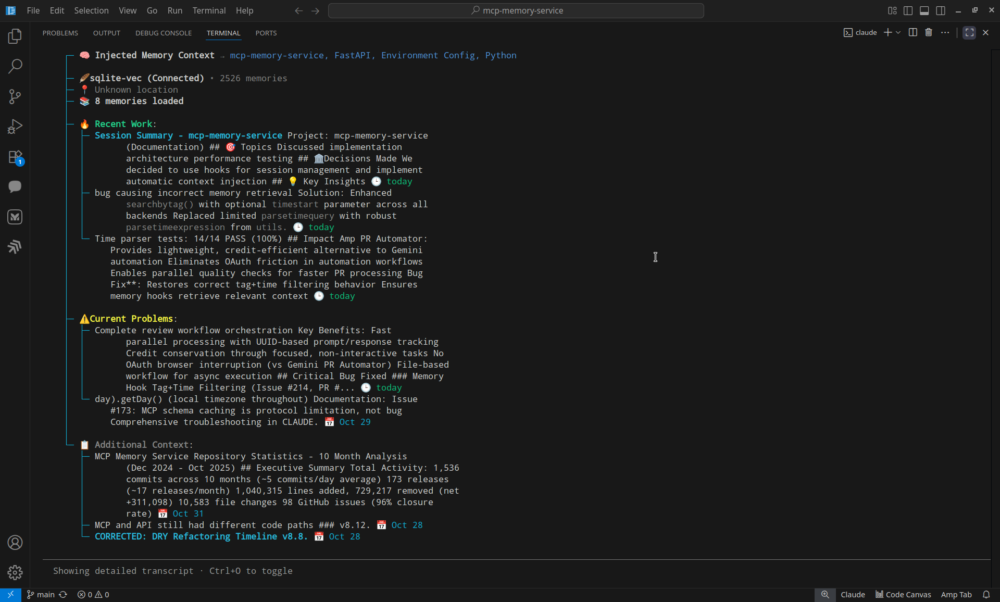

# mcp-memory-service

## Persistent Shared Memory for AI Agent Pipelines

Open-source memory backend for multi-agent systems.
Agents store decisions, share causal knowledge graphs, and retrieve
context in 5ms — without cloud lock-in or API costs.

**Works with LangGraph · CrewAI · AutoGen · any HTTP client · Claude Desktop**

---

[](https://opensource.org/licenses/Apache-2.0)
[](https://pypi.org/project/mcp-memory-service/)
[](https://pypi.org/project/mcp-memory-service/)
[](https://github.com/doobidoo/mcp-memory-service/stargazers)
[](https://github.com/langchain-ai/langgraph)
[](https://crewai.com)
[](https://github.com/microsoft/autogen)
[](https://claude.ai)
[](https://cursor.sh)
[](https://github.com/sponsors/doobidoo)

---

## Why Agents Need This

| Without mcp-memory-service | With mcp-memory-service |
|---|---|
| Each agent run starts from zero | Agents retrieve prior decisions in 5ms |
| Memory is local to one graph/run | Memory is shared across all agents and runs |
| You manage Redis + Pinecone + glue code | One self-hosted service, zero cloud cost |
| No causal relationships between facts | Knowledge graph with typed edges (causes, fixes, contradicts) |
| Context window limits create amnesia | Autonomous consolidation compresses old memories |

**Key capabilities for agent pipelines:**
- **Framework-agnostic REST API** — 15 endpoints, no MCP client library needed
- **Knowledge graph** — agents share causal chains, not just facts
- **`X-Agent-ID` header** — auto-tag memories by agent identity for scoped retrieval
- **`conversation_id`** — bypass deduplication for incremental conversation storage
- **SSE events** — real-time notifications when any agent stores or deletes a memory
- **Embeddings run locally via ONNX** — memory never leaves your infrastructure

## Agent Quick Start

```bash
pip install mcp-memory-service
MCP_ALLOW_ANONYMOUS_ACCESS=true memory server --http
# REST API running at http://localhost:8000
```

```python
import httpx

BASE_URL = "http://localhost:8000"

# Store — auto-tag with X-Agent-ID header
async with httpx.AsyncClient() as client:
    await client.post(f"{BASE_URL}/api/memories", json={
        "content": "API rate limit is 100 req/min",
        "tags": ["api", "limits"],
    }, headers={"X-Agent-ID": "researcher"})
    # Stored with tags: ["api", "limits", "agent:researcher"]

# Search — scope to a specific agent
    results = await client.post(f"{BASE_URL}/api/memories/search", json={
        "query": "API rate limits",
        "tags": ["agent:researcher"],
    })
    print(results.json()["memories"])
```

**Framework-specific guides:** [docs/agents/](docs/agents/)

## Comparison with Alternatives

| | Mem0 | Zep | DIY Redis+Pinecone | **mcp-memory-service** |
|---|---|---|---|---|
| License | Proprietary | Enterprise | — | **Apache 2.0** |
| Cost | Per-call API | Enterprise | Infra costs | **$0** |
| Framework integration | SDK | SDK | Manual | **REST API (any HTTP client)** |
| Knowledge graph | No | Limited | No | **Yes (typed edges)** |
| Auto consolidation | No | No | No | **Yes (decay + compression)** |
| On-premise embeddings | No | No | Manual | **Yes (ONNX, local)** |
| Privacy | Cloud | Cloud | Partial | **100% local** |
| Hybrid search | No | Yes | Manual | **Yes (BM25 + vector)** |
| MCP protocol | No | No | No | **Yes** |
| REST API | Yes | Yes | Manual | **Yes (15 endpoints)** |

---

## Stop Re-Explaining Your Project to AI Every Session

<p align="center">
  
</p>

Your AI assistant forgets everything when you start a new chat. After 50 tool uses, context explodes to 500k+ tokens—Claude slows down, you restart, and now it remembers nothing. You spend 10 minutes re-explaining your architecture. **Again.**

**MCP Memory Service solves this.**

It automatically captures your project context, architecture decisions, and code patterns. When you start fresh sessions, your AI already knows everything—no re-explaining, no context loss, no wasted time.

## 🎥 2-Minute Video Demo

<div align="center">
  <a href="https://www.youtube.com/watch?v=veJME5qVu-A">
    
  </a>
  <p><em>Technical showcase: Performance, Architecture, AI/ML Intelligence & Developer Experience</em></p>
</div>

### ⚡ Works With Your Favorite AI Tools

#### 🤖 Agent Frameworks (REST API)
**LangGraph** · **CrewAI** · **AutoGen** · **Any HTTP Client** · **OpenClaw/Nanobot** · **Custom Pipelines**

#### 🖥️ CLI & Terminal AI (MCP)
**Claude Code** · **Gemini Code Assist** · **OpenCode** · **Aider** · **GitHub Copilot CLI** · **Amp** · **Continue** · **Zed** · **Cody**

#### 🎨 Desktop & IDE (MCP)
**Claude Desktop** · **VS Code** · **Cursor** · **Windsurf** · **Raycast** · **JetBrains** · **Sourcegraph** · **Qodo**

#### 💬 Chat Interfaces (MCP)
**ChatGPT** (Developer Mode) · **Claude Web**

**Works seamlessly with any MCP-compatible client or HTTP client** - whether you're building agent pipelines, coding in the terminal, IDE, or browser.

> **💡 NEW**: ChatGPT now supports MCP! Enable Developer Mode to connect your memory service directly. [See setup guide →](https://github.com/doobidoo/mcp-memory-service/discussions/377#discussioncomment-15605174)

---

## 🚀 Get Started in 60 Seconds

**1. Install:**

```bash
pip install mcp-memory-service
```

**2. Configure your AI client:**

<details open>
<summary><strong>Claude Desktop</strong></summary>

Add to your config file:
- **macOS**: `~/Library/Application Support/Claude/claude_desktop_config.json`
- **Windows**: `%APPDATA%\Claude\claude_desktop_config.json`
- **Linux**: `~/.config/Claude/claude_desktop_config.json`

```json
{
  "mcpServers": {
    "memory": {
      "command": "memory",
      "args": ["server"]
    }
  }
}
```

Restart Claude Desktop. Your AI now remembers everything across sessions.

</details>

<details>
<summary><strong>Claude Code</strong></summary>

```bash
claude mcp add memory -- memory server
```

Restart Claude Code. Memory tools will appear automatically.

</details>

<details>
<summary><strong>🔧 Advanced: Custom Backends & Team Setup</strong></summary>

For production deployments, team collaboration, or cloud sync:

```bash
git clone https://github.com/doobidoo/mcp-memory-service.git
cd mcp-memory-service
python scripts/installation/install.py
```

Choose from:
- **SQLite** (local, fast, single-user)
- **Cloudflare** (cloud, multi-device sync)
- **Hybrid** (best of both: 5ms local + background cloud sync)

</details>

---

## 💡 Why You Need This

### The Problem

| Session 1 | Session 2 (Fresh Start) |
|-----------|-------------------------|
| You: "We're building a Next.js app with Prisma and tRPC" | AI: "What's your tech stack?" ❌ |
| AI: "Got it, I see you're using App Router" | You: *Explains architecture again for 10 minutes* 😤 |
| You: "Add authentication with NextAuth" | AI: "Should I use Pages Router or App Router?" ❌ |

### The Solution

| Session 1 | Session 2 (Fresh Start) |
|-----------|-------------------------|
| You: "We're building a Next.js app with Prisma and tRPC" | AI: "I remember—Next.js App Router with Prisma and tRPC. What should we build?" ✅ |
| AI: "Got it, I see you're using App Router" | You: "Add OAuth login" |
| You: "Add authentication with NextAuth" | AI: "I'll integrate NextAuth with your existing Prisma setup." ✅ |

**Result:** Zero re-explaining. Zero context loss. Just continuous, intelligent collaboration.

---

## 🌐 SHODH Ecosystem Compatibility

MCP Memory Service is **fully compatible** with the [SHODH Unified Memory API Specification v1.0.0](https://github.com/varun29ankuS/shodh-memory/blob/main/specs/openapi.yaml), enabling seamless interoperability across the SHODH ecosystem.

### Compatible Implementations

| Implementation | Backend | Embeddings | Use Case |
|----------------|---------|------------|----------|
| **[shodh-memory](https://github.com/varun29ankuS/shodh-memory)** | RocksDB | MiniLM-L6-v2 (ONNX) | Reference implementation |
| **[shodh-cloudflare](https://github.com/doobidoo/shodh-cloudflare)** | Cloudflare Workers + Vectorize | Workers AI (bge-small) | Edge deployment, multi-device sync |
| **mcp-memory-service** (this) | SQLite-vec / Hybrid | MiniLM-L6-v2 (ONNX) | Desktop AI assistants (MCP) |

### Unified Schema Support

All SHODH implementations share the same memory schema:
- ✅ **Emotional Metadata**: `emotion`, `emotional_valence`, `emotional_arousal`
- ✅ **Episodic Memory**: `episode_id`, `sequence_number`, `preceding_memory_id`
- ✅ **Source Tracking**: `source_type`, `credibility`
- ✅ **Quality Scoring**: `quality_score`, `access_count`, `last_accessed_at`

**Interoperability Example:**
Export memories from mcp-memory-service → Import to shodh-cloudflare → Sync across devices → Full fidelity preservation of emotional_valence, episode_id, and all spec fields.

---

## ✨ Quick Start Features

🧠 **Persistent Memory** – Context survives across sessions with semantic search
🔍 **Smart Retrieval** – Finds relevant context automatically using AI embeddings
⚡ **5ms Speed** – Instant context injection, no latency
🔄 **Multi-Client** – Works across 13+ AI applications
☁️ **Cloud Sync** – Optional Cloudflare backend for team collaboration
🔒 **Privacy-First** – Local-first, you control your data
📊 **Web Dashboard** – Visualize and manage memories at `http://localhost:8000`
🧬 **Knowledge Graph** – Interactive D3.js visualization of memory relationships 🆕

### 🖥️ Dashboard Preview (v9.3.0)

<p align="center">
  
</p>

**8 Dashboard Tabs:** Dashboard • Search • Browse • Documents • Manage • Analytics • **Quality** (NEW) • API Docs

📖 See [Web Dashboard Guide](https://github.com/doobidoo/mcp-memory-service/wiki/Web-Dashboard-Guide) for complete documentation.

---


## Latest Release: **v10.24.0** (March 5, 2026)

**Bug fix: external embedding API failure now raises an error instead of silently corrupting the vector space**

**What's New:**
- **Fix silent fallback on external embedding API failure** (closes #551): When an external embedding provider (vLLM, Ollama, TEI, OpenAI-compatible) returned an error, the service silently fell back to the local ONNX model, mixing embedding spaces and causing all semantic searches to return incorrect results. Now raises a hard `RuntimeError` with the API failure reason and, when detectable, the existing DB dimension.
- **DRY, informative error messages**: Error includes the detected DB embedding dimension from `sqlite_master` (via `_get_existing_db_embedding_dimension()`) to help diagnose mismatches.
- **Stale integration test corrected**: `/api/health` integration test updated to match the security-hardened endpoint (GHSA-73hc-m4hx-79pj stripped the `version` field).
- **1,397 tests** now passing (10 new regression tests for issue #551)

---

**Previous Releases**:
- **v10.23.0** - Quality scorer fix, consolidator improvements, two new opt-out flags: fix asyncio NameError in ai_evaluator.py (#544), fix consolidator invalid memory_type and dedup bug (#545), MCP_TYPED_EDGES_ENABLED opt-out (#546), MCP_CONSOLIDATION_STORE_ASSOCIATIONS opt-out (#547) — 14 new tests
- **v10.22.0** - Consolidation engine stability: fix memory_consolidate status KeyError (#542), prevent exponential metadata prefix nesting (#543), reduce RelationshipInferenceEngine false positive rate (#541) — 40 new tests
- **v10.21.1** - Security: Resolve 5 CodeQL code scanning alerts — removed unused imports, fixed empty except clause with explanatory comment, mitigated stack-trace exposure via `repr()` in consolidation API responses
- **v10.21.0** - Security: Harden health endpoints against info disclosure (GHSA-73hc-m4hx-79pj, CVSS 5.3 Medium) — status-only `/api/health`, auth required on `/api/health/detailed`, default binding `127.0.0.1` (BREAKING), 7 regression tests
- **v10.20.6** - Security patch: Fix MITM vulnerability in peer discovery TLS (GHSA-x9r8-q2qj-cgvw, CVSS 7.4 High) — TLS verification now enabled by default, `MCP_PEER_VERIFY_SSL` / `MCP_PEER_SSL_CA_FILE` opt-out options, AST regression test
- **v10.20.5** - Fix: Standardize content-only hashing across all call sites — removed `metadata` param from `generate_content_hash()`, updated 5 call sites, 7 unit tests (PR #536, closes #522)
- **v10.20.4** - Bug fixes: Cloudflare/Hybrid tags column always NULL in D1 INSERT (delete_by_tags silently failing) + empty-tag LIKE false matches guard (PR #534, contributor: shawnsw)
- **v10.20.3** - Bug fixes: HTTP server auto-start (wrong module path, env var handling, startup polling, auth forwarding) + hook installer improvements (pyproject.toml check, API key generation, dual-server guidance) (PRs #529, #531)
- **v10.20.2** - Bug fix: TypeError in `_prompt_learning_session` (missing `content_hash` in `Memory` constructor, PR #521)
- **v10.20.1** - Security patch: serialize-javascript RCE (alerts #44 #45) + pypdf RAM exhaustion (CVE-2026-28351 / CVE-2026-27888, alerts #43 #46)
- **v10.20.0** - Streamable HTTP transport with OAuth 2.1 + PKCE for Claude.ai remote MCP connectivity (`--streamable-http`, PKCE S256, RFC 9728, #518)
- **v10.19.0** - Read-only OAuth status display in dashboard (`GET /api/oauth/status`, Settings > System Info, i18n for 7 locales, #515, closes #259)
- **v10.18.3** - Security patch: 5 Dependabot vulnerabilities fixed (minimatch ReDoS CVE-2026-27903/27904 #39-#42, pypdf RAM exhaustion CVE-2026-27888 #43)
- **v10.18.2** - Dev dependency fix: add missing pytest-timeout/pytest-subtests, fix update_and_restart.sh to install .[dev] (#509, closes #508)
- **v10.18.1** - Security patch: sanitize consolidation recommendations response (CWE-209, CodeQL alert #356 py/stack-trace-exposure)
- **v10.18.0** - SSE transport mode (`--sse` flag), hook installer improvements (merge, raised timeouts, uvx support), setup docs for pyenv+uvx
- **v10.17.16** - Security patch: fix minimatch ReDoS (Dependabot #3/#6, High), replace abandoned PyPDF2 with pypdf (Dependabot moderate)
- **v10.17.15** - Permission-Request Hook Made Opt-In (no silent global hook installation, CLI flags added)
- **v10.17.14** - Security + Performance: CVE-2024-23342 (ecdsa Minerva attack) eliminated via PyJWT migration, CWE-209 fixed, MCP_ASSOCIATION_MAX_PAIRS raised 100→1000
- **v10.17.13** - Security: Final 4 CodeQL Alerts Resolved (log-injection, stack-trace-exposure) — Zero Open Alerts
- **v10.17.12** - Security: File Restoration + 43 CodeQL Alerts (repeated-import, multiple-definition, log-injection, stack-trace-exposure)
- **v10.17.11** - Security: 6 CodeQL Alerts Resolved (log injection, stack-trace-exposure, unused variable)
- **v10.17.10** - Security: All 30 Remaining CodeQL Alerts Resolved (log injection, clear-text logging, URL redirection, stack-trace-exposure)
- **v10.17.9** - Security: 17 CodeQL Alerts Resolved (clear-text logging, log injection, tarslip, ReDoS, URL redirection)
- **v10.17.8** - Security: 27 CodeQL Alerts Resolved (clear-text logging, log injection, stack-trace-exposure, URL redirection, polynomial ReDoS, empty-except, unused imports)
- **v10.17.7** - Security: 100 CodeQL Alerts Resolved (security + code quality)
- **v10.17.6** - Code Quality: 100 CodeQL Import Alerts Resolved Across 51 Files (unused-import, repeated-import, cyclic-import)
- **v10.17.5** - Security Patch: upgrade 15 vulnerable dependencies (38 Dependabot alerts - h11, aiohttp, starlette, cryptography, pillow, protobuf, and more)
- **v10.17.3** - Security + Code Quality: 21 CodeQL Scanning Alerts Resolved (log injection CWE-117, HTTPClientStorage signature, import-time prints)
- **v10.17.2** - CI Stability Fixes: uv CLI test timeout 60s→120s, CI job timeout 10→20min, root install.py test skip guard
- **v10.17.1** - Hook System Bug Fixes + Root Installer + Session-Start Reliability (session-end SyntaxError on Node.js v24, MCP_HTTP_PORT detection, exponential backoff retry)
- **v10.17.0** - Default "untagged" Tag for All Tagless Memories + Cleanup Script (306 production memories retroactively fixed)
- **v10.16.1** - Windows MCP Initialization Timeout Fix (`MCP_INIT_TIMEOUT` env override, 7 unit tests)
- **v10.16.0** - Agentic AI Market Repositioning with REST API Integration Guides (LangGraph, CrewAI, AutoGen guides, X-Agent-ID header auto-tagging, agent: tag namespace)
- **v10.15.1** - Stale Venv Detection for Moved/Renamed Projects (auto-recreate venv when pip shebang interpreter path is missing)
- **v10.15.0** - Config Validation & Safe Environment Parsing (`validate_config()` at startup, `safe_get_int_env()`, 8 new robustness tests)
- **v10.14.0** - `conversation_id` Support for Incremental Conversation Saves (semantic dedup bypass, metadata storage, all backends)
- **v10.13.2** - Consolidation & Hybrid Storage Bug Fixes (missing StorageProtocol proxy methods, timezone-aware datetime, contributed by @VibeCodeChef)
- **v10.13.1** - Critical Bug Fixes (tag search limits, REST API field access, metadata corruption, hash display, prompt handler crashes)
- **v10.13.0** - Test Suite Stability (100% pass rate, 1,161 passing tests, authentication testing patterns)
- **v10.12.1** - Custom Memory Type Configuration Test Fixes (test isolation, environment cleanup)
- **v10.12.0** - Configurable Memory Type Ontology (75 types supporting PM and knowledge work, custom type configuration)
- **v10.11.2** - Tag Filtering & Security Hardening (DoS protection, SQL-level optimization, comprehensive tests)
- **v10.11.1** - MCP Prompt Handlers Fix (all 5 prompt handlers working, 100% success rate restored)
- **v10.11.0** - SQLite Integrity Monitoring (automatic corruption detection/repair, 3.5ms overhead, emergency export)
- **v10.10.6** - Test Infrastructure Improvements (Python 3.11 compatibility, pytest-benchmark, coverage baseline)
- **v10.10.5** - Embedding Dimension Cache Fix (dimension mismatch prevention, cache consistency)
- **v10.10.4** - CLI Batch Ingestion Fix (async bug causing "NoneType" errors, 100% success rate restored)
- **v10.10.3** - Test Infrastructure & Memory Scoring Fixes (graph validation, test authentication, score capping)
- **v10.10.2** - Memory Injection Filtering (minRelevanceScore enforcement, project-affinity filter, security hardening)
- **v10.10.1** - Search Handler Fix, Import Error Fix, Security Enhancement, Improved Exact Search
- **v10.10.0** - Environment Configuration Viewer (11 categorized parameters, sensitive masking, Settings Panel integration)
- **v10.9.0** - Batched Inference Performance (4-16x GPU speedup, 2.3-2.5x CPU speedup with adaptive GPU dispatch)
- **v10.9.0** - Batched Inference Performance (4-16x GPU speedup, 2.3-2.5x CPU speedup with adaptive GPU dispatch)
- **v10.8.0** - Hybrid BM25 + Vector Search (combines keyword matching with semantic search, solves exact match problem)
- **v10.7.2** - Server Management Button Fix (Settings modal buttons causing page reload)
- **v10.7.1** - Dashboard API Authentication Fix (complete auth coverage for all endpoints)
- **v10.7.0** - Backup UI Enhancements (View Backups modal, backup directory display, enhanced API)
- **v10.6.1** - Dashboard SSE Authentication Fix (EventSource API compatibility with query params)
- **v10.6.0** - Server Management Dashboard: Complete server administration from Dashboard Settings
- **v10.5.1** - Test Environment Safety: 4 critical scripts to prevent production database testing
- **v10.5.0** - Dashboard Authentication UI: Graceful user experience (authentication modal, API key/OAuth flows)
- **v10.4.6** - Documentation Enhancement: HTTP dashboard authentication requirements clarified (authentication setup examples)
- **v10.4.5** - Unified CLI Interface: `memory server --http` flag (easier UX, single command)
- **v10.4.4** - CRITICAL Security Fix: Timing attack vulnerability in API key comparison (CWE-208) + API Key Auth without OAuth
- **v10.4.2** - Docker Container Startup Fix (ModuleNotFoundError: aiosqlite)
- **v10.4.1** - Bug Fix: Time Expression Parsing (natural language time expressions fixed)
- **v10.4.0** - Memory Hook Quality Improvements (semantic deduplication, tag normalization, budget optimization)
- **v10.2.1** - MCP Client Compatibility & Delete Operations Fixes (integer enum fix, method name corrections)
- **v10.2.0** - External Embedding API Support (vLLM, Ollama, TEI, OpenAI integration)
- **v10.1.2** - Windows PowerShell 7+ Service Management Fix (SSL compatibility for manage_service.ps1)
- **v10.1.1** - Dependency & Windows Compatibility Fixes (requests dependency, PowerShell 7+ SSL support)
- **v10.1.0** - Python 3.14 Support (Extended compatibility to 3.10-3.14, tokenizers upgrade)
- **v10.0.3** - CRITICAL FIX: Backup Scheduler Now Works (2 critical bugs fixed, FastAPI lifespan integration)
- **v10.0.2** - Tool List Cleanup (Only 12 unified tools visible, 64% tool reduction complete)
- **v10.0.1** - CRITICAL HOTFIX: MCP tools loading restored (Python boolean fix)
- **v10.0.0** - ⚠️ BROKEN: Major API Redesign (64% Tool Consolidation) - Tools failed to load, use v10.0.2 instead
- **v9.3.1** - Critical shutdown bug fix (SIGTERM/SIGINT handling, clean server termination)
- **v9.3.0** - Relationship Inference Engine (Intelligent association typing, multi-factor analysis, confidence scoring)
- **v9.2.1** - Critical Knowledge Graph bug fix (MigrationRunner, 37 test fixes, idempotent migrations)
- **v9.2.0** - Knowledge Graph Dashboard with D3.js v7.9.0 (Interactive force-directed visualization, 6 typed relationships, 7-language support)
- **v9.0.6** - OAuth Persistent Storage Backend (SQLite-based for multi-worker deployments, <10ms token operations)
- **v9.0.5** - CRITICAL HOTFIX: OAuth 2.1 token endpoint routing bug fixed (HTTP 422 errors eliminated)
- **v9.0.4** - OAuth validation blocking server startup fixed (OAUTH_ENABLED default changed to False, validation made non-fatal)
- **v9.0.2** - Critical hotfix: Includes actual code fix for mass deletion bug (confirm_count parameter now REQUIRED)
- **v9.0.1** - Incorrectly tagged release (⚠️ Does NOT contain fix - use v9.0.2 instead)
- **v9.0.0** - Phase 0 Ontology Foundation (⚠️ Contains critical bug - upgrade to v9.0.2 immediately)
- **v8.76.0** - Official Lite Distribution (90% size reduction: 7.7GB → 805MB, dual publishing workflow)
- **v8.75.1** - Hook Installer Fix (flexible MCP server naming support, custom configurations)
- **v8.75.0** - Lightweight ONNX Quality Scoring (90% installation size reduction: 7.7GB → 805MB, same quality scoring performance)
- **v8.74.0** - Cross-Platform Orphan Process Cleanup (database lock prevention, automatic orphan detection after crashes)
- **v8.73.0** - Universal Permission Request Hook (auto-approves safe operations, eliminates repetitive prompts for 12+ tools)
- **v8.72.0** - Graph Traversal MCP Tools (find_connected_memories, find_shortest_path, get_memory_subgraph - 5-25ms, 30x faster)
- **v8.71.0** - Memory Management APIs and Graceful Shutdown (cache cleanup, process monitoring, production-ready memory management)
- **v8.70.0** - User Override Commands for Memory Hooks (`#skip`/`#remember` for manual memory control)
- **v8.69.0** - MCP Tool Annotations for Improved LLM Decision-Making (readOnlyHint/destructiveHint, auto-approval for 12 tools)
- **v8.68.2** - Platform Detection Improvements (Apple Silicon MPS support, 3-5x faster, comprehensive hardware detection)
- **v8.68.1** - Critical Data Integrity Bug Fix - Hybrid Backend (ghost memories fixed, 5 method fixes)
- **v8.68.0** - Update & Restart Automation (87% time reduction, <2 min workflow, cross-platform scripts)
- **v8.62.13** - HTTP-MCP Bridge API Endpoint Fix (Remote deployments restored with POST endpoints)
- **v8.62.12** - Quality Analytics UI Fixed ("Invalid Date" and "ID: undefined" bugs)
- **v8.62.10** - Document Ingestion Bug Fixed (NameError in web console, circular import prevention)
- **v8.62.8** - Environment Configuration Loading Bug Fixed (.env discovery, python-dotenv dependency)
- **v8.62.7** - Windows SessionStart Hook Bug Fixed in Claude Code 2.0.76+ (no more Windows hanging)
- **v8.62.6** - CRITICAL PRODUCTION HOTFIX: SQLite Pragmas Container Restart Bug (database locking errors after container restarts)
- **v8.62.5** - Test Suite Stability: 40 Tests Fixed (99% pass rate, 68% → 99% improvement)
- **v8.62.4** - CRITICAL BUGFIX: SQLite-Vec KNN Syntax Error (semantic search completely broken on sqlite-vec/hybrid backends)
- **v8.62.3** - CRITICAL BUGFIX: Memory Recall Handler Import Error (time_parser import path correction)
- **v8.62.2** - Test Infrastructure Improvements (5 test failures resolved, consolidation & performance suite stability)
- **v8.62.1** - Critical Bug Fix: SessionEnd Hook Real Conversation Data (hardcoded mock data fix, robust transcript parsing)
- **v8.62.0** - Comprehensive Test Coverage Infrastructure - 100% Handler Coverage Achievement (35 tests, 800+ lines, CI/CD gate)
- **v8.61.2** - CRITICAL HOTFIX: delete_memory KeyError Fix (response parsing, validated delete flow)
- **v8.61.1** - CRITICAL HOTFIX: Import Error Fix (5 MCP tools restored, relative import path correction)
- **v8.60.0** - Health Check Strategy Pattern Refactoring - Phase 3.1 (78% complexity reduction, Strategy pattern)
- **v8.59.0** - Server Architecture Refactoring - Phase 2 (40% code reduction, 29 handlers extracted, 5 specialized modules)
- **v8.58.0** - Test Infrastructure Stabilization - 100% Pass Rate Achievement (81.6% → 100%, 52 tests fixed)
- **v8.57.1** - Hotfix: Python -m Execution Support for CI/CD (server/__main__.py, --version/--help flags)
- **v8.57.0** - Test Infrastructure Improvements - Major Stability Boost (+6% pass rate, 32 tests fixed)
- **v8.56.0** - Server Architecture Refactoring - Phase 1 (4 focused modules, -7% lines, backward compatible)
- **v8.55.0** - AI-Optimized MCP Tool Descriptions (30-50% reduction in incorrect tool selection)
- **v8.54.4** - Critical MCP Tool Bugfix (check_database_health method call correction)
- **v8.54.3** - Chunked Storage Error Reporting Fix (accurate failure messages, partial success tracking)
- **v8.54.2** - Offline Mode Fix (opt-in offline mode, first-time install support)
- **v8.54.1** - UV Virtual Environment Support (installer compatibility fix)
- **v8.54.0** - Smart Auto-Capture System (intelligent pattern detection, 6 memory types, bilingual support)
- **v8.53.0** - Windows Service Management (Task Scheduler support, auto-startup, watchdog monitoring, 819 lines PowerShell automation)
- **v8.52.2** - Hybrid Backend Maintenance Enhancement (multi-PC association cleanup, drift prevention, Vectorize error handling)
- **v8.52.1** - Windows Embedding Fallback & Script Portability (DLL init failure fix, MCP_HTTP_PORT support)
- **v8.52.0** - Time-of-Day Emoji Icons (8 time-segment indicators, dark mode support, automatic timezone)
- **v8.51.0** - Graph Database Architecture (30x query performance, 97% storage reduction for associations)
- **v8.50.1** - Critical Bug Fixes (MCP_EMBEDDING_MODEL fix, installation script backend support, i18n quality analytics complete)
- **v8.50.0** - Fallback Quality Scoring (DeBERTa + MS-MARCO hybrid, technical content rescue, 20/20 tests passing)
- **v8.49.0** - DeBERTa Quality Classifier (absolute quality assessment, eliminates self-matching bias)
- **v8.48.4** - Cloudflare D1 Drift Detection Performance (10-100x faster queries, numeric comparison fix)
- **v8.48.3** - Code Execution Hook Fix - 75% token reduction now working (fixed time_filter parameter, Python warnings, venv detection)
- **v8.48.2** - HTTP Server Auto-Start & Time Parser Improvements (smart service management, "last N periods" support)
- **v8.48.1** - Critical Hotfix - Startup Failure Fix (redundant calendar import removed, immediate upgrade required)
- **v8.48.0** - CSV-Based Metadata Compression (78% size reduction, 100% sync success, metadata validation)
- **v8.47.1** - ONNX Quality Evaluation Bug Fixes (self-match fix, association pollution, sync queue overflow, realistic distribution)
- **v8.47.0** - Association-Based Quality Boost (connection-based enhancement, network effect leverage, metadata persistence)
- **v8.46.3** - Quality Score Persistence Fix (ONNX scores in hybrid backend, metadata normalization)
- **v8.46.2** - Session-Start Hook Crash Fix + Hook Installer Improvements (client-side tag filtering, isolated version metadata)
- **v8.46.1** - Windows Hooks Installer Fix + Quality System Integration (UTF-8 console configuration, backend quality scoring)
- **v8.45.3** - ONNX Ranker Model Export Fix (automatic model export, offline mode support, 7-16ms CPU performance)
- **v8.45.2** - Dashboard Dark Mode Consistency Fixes (global CSS overrides, Chart.js dark mode support)
- **v8.45.1** - Quality System Test Infrastructure Fixes (HTTP API router, storage retrieval, async test client)
- **v8.45.0** - Memory Quality System - AI-Driven Automatic Quality Scoring (ONNX-powered local SLM, multi-tier fallback, quality-based retention)
- **v8.44.0** - Multi-Language Expansion (Japanese, Korean, German, French, Spanish - 359 keys each, complete i18n coverage)
- **v8.43.0** - Internationalization & Quality Automation (English/Chinese i18n, Claude branch automation, quality gates)
- **v8.42.1** - MCP Resource Handler Fix (`AttributeError` with Pydantic AnyUrl objects)
- **v8.42.0** - Memory Awareness Enhancements (visible memory injection, quality session summaries, LLM-powered summarization)
- **v8.41.2** - Hook Installer Utility File Deployment (ALL 14 utilities copied, future-proof glob pattern)
- **v8.41.1** - Context Formatter Memory Sorting (recency sorting within categories, newest first)
- **v8.41.0** - Session Start Hook Reliability Improvements (error suppression, clean output, memory filtering, classification fixes)
- **v8.40.0** - Session Start Version Display (automatic version comparison, PyPI status labels)
- **v8.39.1** - Dashboard Analytics Bug Fixes: Three critical fixes (top tags filtering, recent activity display, storage report fields)
- **v8.39.0** - Performance Optimization: Storage-layer date-range filtering (10x faster analytics, 97% data transfer reduction)
- **v8.38.1** - Critical Hotfix: HTTP MCP JSON-RPC 2.0 compliance fix (Claude Code/Desktop connection failures resolved)
- **v8.38.0** - Code Quality: Phase 2b COMPLETE (~176-186 lines duplicate code eliminated, 10 consolidations)
- **v8.37.0** - Code Quality: Phase 2a COMPLETE (5 duplicate high-complexity functions eliminated)
- **v8.36.1** - Critical Hotfix: HTTP server startup crash fix (forward reference error in analytics.py)
- **v8.36.0** - Code Quality: Phase 2 COMPLETE (100% of target achieved, -39 complexity points)
- **v8.35.0** - Code Quality: Phase 2 Batch 1 (install.py, cloudflare.py, -15 complexity points)
- **v8.34.0** - Code Quality: Phase 2 Complexity Reduction (analytics.py refactored, 11 → 6-7 complexity)
- **v8.33.0** - Critical Installation Bug Fix + Code Quality Improvements (dead code cleanup, automatic MCP setup)
- **v8.32.0** - Code Quality Excellence: pyscn Static Analysis Integration (multi-layer QA workflow)
- **v8.31.0** - Revolutionary Batch Update Performance (21,428x faster memory consolidation)
- **v8.30.0** - Analytics Intelligence: Adaptive Charts & Critical Data Fixes (accurate trend visualization)
- **v8.28.1** - Critical HTTP MCP Transport JSON-RPC 2.0 Compliance Fix (Claude Code compatibility)
- **v8.28.0** - Cloudflare AND/OR Tag Filtering (unified search API, 3-5x faster hybrid sync)
- **v8.27.1** - Critical Hotfix: Timestamp Regression (created_at preservation during metadata sync)
- **v8.26.0** - Revolutionary MCP Performance (534,628x faster tools, 90%+ cache hit rate)
- **v8.25.0** - Hybrid Backend Drift Detection (automatic metadata sync, bidirectional awareness)
- **v8.24.4** - Code Quality Improvements from Gemini Code Assist (regex sanitization, DOM caching)
- **v8.24.3** - Test Coverage & Release Agent Improvements (tag+time filtering tests, version history fix)
- **v8.24.2** - CI/CD Workflow Fixes (bash errexit handling, exit code capture)
- **v8.24.1** - Test Infrastructure Improvements (27 test failures resolved, 63% → 71% pass rate)
- **v8.24.0** - PyPI Publishing Enabled (automated package publishing via GitHub Actions)
- **v8.23.1** - Stale Virtual Environment Prevention System (6-layer developer protection)
- **v8.23.0** - Consolidation Scheduler via Code Execution API (88% token reduction)

**📖 Full Details**: [CHANGELOG.md](CHANGELOG.md) | [All Releases](https://github.com/doobidoo/mcp-memory-service/releases)

---

## Migration to v9.0.0

**⚡ TL;DR**: No manual migration needed - upgrades happen automatically!

**Breaking Changes:**
- **Memory Type Ontology**: Legacy types auto-migrate to new taxonomy (task→observation, note→observation)
- **Asymmetric Relationships**: Directed edges only (no longer bidirectional)

**Migration Process:**
1. Stop your MCP server
2. Update to latest version (`git pull` or `pip install --upgrade mcp-memory-service`)
3. Restart server - automatic migrations run on startup:
   - Database schema migrations (009, 010)
   - Memory type soft-validation (legacy types → observation)
   - No tag migration needed (backward compatible)

**Safety**: Migrations are idempotent and safe to re-run

---

### Breaking Changes

#### 1. Memory Type Ontology

**What Changed:**
- Legacy memory types (task, note, standard) are deprecated
- New formal taxonomy: 5 base types (observation, decision, learning, error, pattern) with 21 subtypes
- Type validation now defaults to 'observation' for invalid types (soft validation)

**Migration Process:**
✅ **Automatic** - No manual action required!

When you restart the server with v9.0.0:
- Invalid memory types are automatically soft-validated to 'observation'
- Database schema updates run automatically
- Existing memories continue to work without modification

**New Memory Types:**
- observation: General observations, facts, and discoveries
- decision: Decisions and planning
- learning: Learnings and insights
- error: Errors and failures
- pattern: Patterns and trends

**Backward Compatibility:**
- Existing memories will be auto-migrated (task→observation, note→observation, standard→observation)
- Invalid types default to 'observation' (no errors thrown)

#### 2. Asymmetric Relationships

**What Changed:**
- Asymmetric relationships (causes, fixes, supports, follows) now store only directed edges
- Symmetric relationships (related, contradicts) continue storing bidirectional edges
- Database migration (010) removes incorrect reverse edges

**Migration Required:**
No action needed - database migration runs automatically on startup.

**Code Changes Required:**
If your code expects bidirectional storage for asymmetric relationships:

```python
# OLD (will no longer work):
# Asymmetric relationships were stored bidirectionally
result = storage.find_connected(memory_id, relationship_type="causes")

# NEW (correct approach):
# Use direction parameter for asymmetric relationships
result = storage.find_connected(
    memory_id,
    relationship_type="causes",
    direction="both"  # Explicit direction required for asymmetric types
)
```

**Relationship Types:**
- Asymmetric: causes, fixes, supports, follows (A→B ≠ B→A)
- Symmetric: related, contradicts (A↔B)

### Performance Improvements

- ontology validation: 97.5x faster (module-level caching)
- Type lookups: 35.9x faster (cached reverse maps)
- Tag validation: 47.3% faster (eliminated double parsing)

### Testing

- 829/914 tests passing (90.7%)
- 80 new ontology tests with 100% backward compatibility
- All API/HTTP integration tests passing

### Support

If you encounter issues during migration:
- Check [Troubleshooting Guide](docs/troubleshooting/)
- Review [CHANGELOG.md](CHANGELOG.md) for detailed changes
- Open an issue: https://github.com/doobidoo/mcp-memory-service/issues

---

## 📚 Documentation & Resources

- **[Agent Integration Guides](docs/agents/)** 🆕 – LangGraph, CrewAI, AutoGen, HTTP generic
- **[Installation Guide](docs/installation.md)** – Detailed setup instructions
- **[Configuration Guide](docs/mastery/configuration-guide.md)** – Backend options and customization
- **[Architecture Overview](docs/architecture.md)** – How it works under the hood
- **[Team Setup Guide](docs/teams.md)** – OAuth and cloud collaboration
- **[Knowledge Graph Dashboard](docs/features/knowledge-graph-dashboard.md)** 🆕 – Interactive graph visualization guide
- **[Troubleshooting](docs/troubleshooting/)** – Common issues and solutions
- **[API Reference](docs/api.md)** – Programmatic usage
- **[Wiki](https://github.com/doobidoo/mcp-memory-service/wiki)** – Complete documentation
- [](https://deepwiki.com/doobidoo/mcp-memory-service) – AI-powered documentation assistant
- **[MCP Starter Kit](https://kruppster57.gumroad.com/l/glbhd)** – Build your own MCP server using the patterns from this project

---

## 🤝 Contributing

We welcome contributions! See [CONTRIBUTING.md](CONTRIBUTING.md) for guidelines.

**Quick Development Setup:**
```bash
git clone https://github.com/doobidoo/mcp-memory-service.git
cd mcp-memory-service
pip install -e .  # Editable install
pytest tests/      # Run test suite
```

---

## ⭐ Support

If this saves you time, give us a star! ⭐

- **Issues**: [GitHub Issues](https://github.com/doobidoo/mcp-memory-service/issues)
- **Discussions**: [GitHub Discussions](https://github.com/doobidoo/mcp-memory-service/discussions)
- **Wiki**: [Documentation Wiki](https://github.com/doobidoo/mcp-memory-service/wiki)

---

## 📄 License

Apache 2.0 – See [LICENSE](LICENSE) for details.

---

<p align="center">
  <strong>Never explain your project to AI twice.</strong><br/>
  Start using MCP Memory Service today.
</p>

## ⚠️ v6.17.0+ Script Migration Notice

**Updating from an older version?** Scripts have been reorganized for better maintainability:
- **Recommended**: Use `python -m mcp_memory_service.server` in your Claude Desktop config (no path dependencies!)
- **Alternative 1**: Use `uv run memory server` with UV tooling
- **Alternative 2**: Update path from `scripts/run_memory_server.py` to `scripts/server/run_memory_server.py`
- **Backward compatible**: Old path still works with a migration notice

## ⚠️ First-Time Setup Expectations

On your first run, you'll see some warnings that are **completely normal**:

- **"WARNING: Failed to load from cache: No snapshots directory"** - The service is checking for cached models (first-time setup)
- **"WARNING: Using TRANSFORMERS_CACHE is deprecated"** - Informational warning, doesn't affect functionality
- **Model download in progress** - The service automatically downloads a ~25MB embedding model (takes 1-2 minutes)

These warnings disappear after the first successful run. The service is working correctly! For details, see our [First-Time Setup Guide](docs/first-time-setup.md).

### 🐍 Python 3.13 Compatibility Note

**sqlite-vec** may not have pre-built wheels for Python 3.13 yet. If installation fails:
- The installer will automatically try multiple installation methods
- Consider using Python 3.12 for the smoothest experience: `brew install python@3.12`
- Alternative: Use Cloudflare backend with `--storage-backend cloudflare`
- See [Troubleshooting Guide](docs/troubleshooting/general.md#python-313-sqlite-vec-issues) for details

### 🍎 macOS SQLite Extension Support

**macOS users** may encounter `enable_load_extension` errors with sqlite-vec:
- **System Python** on macOS lacks SQLite extension support by default
- **Solution**: Use Homebrew Python: `brew install python && rehash`
- **Alternative**: Use pyenv: `PYTHON_CONFIGURE_OPTS='--enable-loadable-sqlite-extensions' pyenv install 3.12.0`
- **If using uvx/uv**: Add `UV_PYTHON_PREFERENCE=only-managed` to your MCP server `env` block — this forces uv to use its own managed Python (which has SQLite extension support) instead of your pyenv Python
- **Fallback**: Use Cloudflare or Hybrid backend: `--storage-backend cloudflare` or `--storage-backend hybrid`
- See [Troubleshooting Guide](docs/troubleshooting/general.md#macos-sqlite-extension-issues) for details

## 🎯 Memory Awareness in Action

**Intelligent Context Injection** - See how the memory service automatically surfaces relevant information at session start:



**What you're seeing:**
- 🧠 **Automatic memory injection** - 8 relevant memories found from 2,526 total
- 📂 **Smart categorization** - Recent Work, Current Problems, Additional Context
- 📊 **Git-aware analysis** - Recent commits and keywords automatically extracted
- 🎯 **Relevance scoring** - Top memories scored at 100% (today), 89% (8d ago), 84% (today)
- ⚡ **Fast retrieval** - SQLite-vec backend with 5ms read performance
- 🔄 **Background sync** - Hybrid backend syncing to Cloudflare

**Result**: Claude starts every session with full project context - no manual prompting needed.

## 📚 Complete Documentation

**👉 Visit our comprehensive [Wiki](https://github.com/doobidoo/mcp-memory-service/wiki) for detailed guides:**

### 🧠 v7.1.3 Natural Memory Triggers (Latest)
- **[Natural Memory Triggers v7.1.3 Guide](https://github.com/doobidoo/mcp-memory-service/wiki/Natural-Memory-Triggers-v7.1.0)** - Intelligent automatic memory awareness
  - ✅ **85%+ trigger accuracy** with semantic pattern detection
  - ✅ **Multi-tier performance** (50ms instant → 150ms fast → 500ms intensive)
  - ✅ **CLI management system** for real-time configuration
  - ✅ **Git-aware context** integration for enhanced relevance
  - ✅ **Zero-restart installation** with dynamic hook loading

### 🆕 v7.0.0 OAuth & Team Collaboration
- **[🔐 OAuth 2.1 Setup Guide](https://github.com/doobidoo/mcp-memory-service/wiki/OAuth-2.1-Setup-Guide)** - **NEW!** Complete OAuth 2.1 Dynamic Client Registration guide
- **[🔗 Integration Guide](https://github.com/doobidoo/mcp-memory-service/wiki/03-Integration-Guide)** - Claude Desktop, **Claude Code HTTP transport**, VS Code, and more
- **[🛡️ Advanced Configuration](https://github.com/doobidoo/mcp-memory-service/wiki/04-Advanced-Configuration)** - **Updated!** OAuth security, enterprise features

### 🧬 v8.23.0+ Memory Consolidation
- **[📊 Memory Consolidation System Guide](https://github.com/doobidoo/mcp-memory-service/wiki/Memory-Consolidation-System-Guide)** - **NEW!** Automated memory maintenance with real-world performance metrics
  - ✅ **Dream-inspired consolidation** (decay scoring, association discovery, compression, archival)
  - ✅ **24/7 automatic scheduling** (daily/weekly/monthly via HTTP server)
  - ✅ **Token-efficient Code Execution API** (90% token reduction vs MCP tools)
  - ✅ **Real-world performance data** (4-6 min for 2,495 memories with hybrid backend)
  - ✅ **Three manual trigger methods** (HTTP API, MCP tools, Python API)

### 🚀 Setup & Installation
- **[📋 Installation Guide](https://github.com/doobidoo/mcp-memory-service/wiki/01-Installation-Guide)** - Complete installation for all platforms and use cases
- **[🖥️ Platform Setup Guide](https://github.com/doobidoo/mcp-memory-service/wiki/02-Platform-Setup-Guide)** - Windows, macOS, and Linux optimizations
- **[⚡ Performance Optimization](https://github.com/doobidoo/mcp-memory-service/wiki/05-Performance-Optimization)** - Speed up queries, optimize resources, scaling

### 🧠 Advanced Topics
- **[👨‍💻 Development Reference](https://github.com/doobidoo/mcp-memory-service/wiki/06-Development-Reference)** - Claude Code hooks, API reference, debugging
- **[🔧 Troubleshooting Guide](https://github.com/doobidoo/mcp-memory-service/wiki/07-TROUBLESHOOTING)** - **Updated!** OAuth troubleshooting + common issues
- **[❓ FAQ](https://github.com/doobidoo/mcp-memory-service/wiki/08-FAQ)** - Frequently asked questions
- **[📝 Examples](https://github.com/doobidoo/mcp-memory-service/wiki/09-Examples)** - Practical code examples and workflows

### 📂 Internal Documentation
- **[📊 Repository Statistics](docs/statistics/REPOSITORY_STATISTICS.md)** - 10 months of development metrics, activity patterns, and insights
- **[🏗️ Architecture Specs](docs/architecture/)** - Search enhancement specifications and design documents
- **[👩‍💻 Development Docs](docs/development/)** - AI agent instructions, release checklist, refactoring notes
- **[🚀 Deployment Guides](docs/deployment/)** - Docker, dual-service, and production deployment
- **[📚 Additional Guides](docs/guides/)** - Storage backends, migration, mDNS discovery

## ✨ Key Features

### 🏆 **Production-Ready Reliability** 🆕 v8.9.0
- **Hybrid Backend** - Fast 5ms local SQLite + background Cloudflare sync (RECOMMENDED default)
  - Zero user-facing latency for cloud operations
  - Automatic multi-device synchronization
  - Graceful offline operation
- **Zero Database Locks** - Concurrent HTTP + MCP server access works flawlessly
  - Auto-configured SQLite pragmas (`busy_timeout=15000,cache_size=20000`)
  - WAL mode with proper multi-client coordination
  - Tested: 5/5 concurrent writes succeeded with no errors
- **Auto-Configuration** - Installer handles everything
  - SQLite pragmas for concurrent access
  - Cloudflare credentials with connection testing
  - Claude Desktop integration with hybrid backend
  - Graceful fallback to sqlite_vec if cloud setup fails

### 📄 **Document Ingestion System** v8.6.0
- **Interactive Web UI** - Drag-and-drop document upload with real-time progress
- **Multiple Formats** - PDF, TXT, MD, JSON with intelligent chunking
- **Document Viewer** - Browse chunks, view metadata, search content
- **Smart Tagging** - Automatic tagging with length validation (max 100 chars)
- **Optional semtools** - Enhanced PDF/DOCX/PPTX parsing with LlamaParse
- **Security Hardened** - Path traversal protection, XSS prevention, input validation
- **7 New Endpoints** - Complete REST API for document management

### 🔐 **Enterprise Authentication & Team Collaboration**
- **OAuth 2.1 Dynamic Client Registration** - RFC 7591 & RFC 8414 compliant
- **Claude Code HTTP Transport** - Zero-configuration team collaboration
- **JWT Authentication** - Enterprise-grade security with scope validation
- **Auto-Discovery Endpoints** - Seamless client registration and authorization
- **Multi-Auth Support** - OAuth + API keys + optional anonymous access

### 🧠 **Intelligent Memory Management**
- **Hybrid BM25 + Vector Search** 🆕 v10.8.0 - Best of both worlds for exact match + semantic search
  - Solves exact match problem: 60-70% → near-100% scoring for identical text
  - Parallel execution: BM25 keyword + vector similarity (<15ms latency)
  - Configurable fusion: 30% keyword + 70% semantic (adjustable)
  - Automatic FTS5 index sync via database triggers
  - Backward compatible: `mode="semantic"` unchanged, `mode="hybrid"` opt-in
- **Semantic search** with vector embeddings - Context-aware similarity matching
- **Natural language time queries** - "yesterday", "last week", "3 days ago"
- **Tag-based organization** - Smart categorization with hierarchical support
- **Memory consolidation** - Dream-inspired algorithms for importance scoring
- **Document-aware search** - Query across uploaded documents and manual memories

### 🧬 **Memory Type Ontology** 🆕 v9.0.0
- **Formal Taxonomy** - 5 base types with 21 specialized subtypes
  - `observation` - General observations, facts, discoveries
  - `decision` - Decisions, planning, architecture choices
  - `learning` - Learnings, insights, patterns discovered
  - `error` - Errors, failures, debugging information
  - `pattern` - Patterns, trends, recurring behaviors
- **97.5x Performance** - Module-level caching for validation
- **Auto-Migration** - Backward compatible conversion from legacy types
- **Soft Validation** - Warns but doesn't reject unknown types

📖 See [Memory Type Ontology Guide](docs/guides/memory-ontology-guide.md) for full taxonomy.

### 🔗 **Knowledge Graph & Typed Relationships** 🆕 v9.0.0
- **Relationship Types** - Build semantic networks between memories
  - **Asymmetric**: `causes`, `fixes`, `supports`, `opposes`, `follows`
  - **Symmetric**: `related`, `contradicts`
- **Graph Operations** - Query and traverse memory networks
  - `find_connected_memories` - BFS traversal (1-2 hops)
  - `find_shortest_path` - Compute paths between memories
  - `get_memory_subgraph` - Extract subgraph for visualization
- **Semantic Reasoning** - Automatic causal chain analysis and contradiction detection
- **Performance** - 5-25ms queries, 30x faster than table scans

### 🧬 **Knowledge Graph Dashboard** 🆕 v9.2.0

Visualize your memory relationships with an interactive force-directed graph powered by D3.js v7.9.0.

**Features:**
- **Interactive Graph**: Zoom, pan, drag nodes, hover for details
- **6 Typed Relationships**: causes, fixes, contradicts, supports, follows, related
- **Relationship Chart**: Bar chart showing distribution of relationship types
- **Multi-Language Support**: Fully localized in 7 languages (en, zh, de, es, fr, ja, ko)
- **Dark Mode**: Seamless theme integration with dashboard
- **Performance**: Handles thousands of relationships smoothly (tested with 2,730 relationships)

**Access:** Navigate to Analytics → Knowledge Graph in the dashboard at http://localhost:8000

**Key Capabilities:**
- **Visual Exploration**: Discover hidden connections between memories
- **Semantic Networks**: See causal chains, fix relationships, and contradictions
- **Memory Types**: Color-coded nodes by memory type (observation, decision, learning, error)
- **Real-time Updates**: Graph automatically updates as you add new relationships

📖 See [Knowledge Graph Dashboard Guide](docs/features/knowledge-graph-dashboard.md) for complete documentation.

### 🔗 **Universal Compatibility**
- **Claude Desktop** - Native MCP integration
- **Claude Code** - **HTTP transport** + Memory-aware development with hooks
  - 🪟 **Windows Support**: `/session-start` command for manual session initialization (workaround for issue #160)
  - 🍎 **macOS/Linux**: Full automatic SessionStart hooks + slash command
- **ChatGPT** (Sept 2025+) - **Full MCP support via Developer Mode** [Setup guide →](https://github.com/doobidoo/mcp-memory-service/discussions/377#discussioncomment-15605174)
  - Supports Streaming HTTP/SSE transports
  - OAuth, Bearer token, and no-auth options
  - Available for Pro, Plus, Business, Enterprise, and Edu accounts
- **VS Code, Cursor, Continue** - IDE extensions
- **15+ AI applications** - REST API compatibility

### 💾 **Flexible Storage**
- **Hybrid** 🌟 (RECOMMENDED) - Fast local SQLite + background Cloudflare sync (v8.9.0 default)
  - 5ms local reads with zero user-facing latency
  - Multi-device synchronization
  - Zero database locks with auto-configured pragmas
  - Automatic backups and cloud persistence
- **SQLite-vec** - Local-only storage (lightweight ONNX embeddings, 5ms reads)
  - Good for single-user offline use
  - No cloud dependencies
- **Cloudflare** - Cloud-only storage (global edge distribution with D1 + Vectorize)
  - Network-dependent performance

> **Note**: All heavy ML dependencies (PyTorch, sentence-transformers) are now optional to dramatically reduce build times and image sizes. SQLite-vec uses lightweight ONNX embeddings by default. Install with `--with-ml` for full ML capabilities.

### 🪶 **Lite Distribution** 🆕 v8.76.0

For resource-constrained environments (CI/CD, edge devices):

```bash
pip install mcp-memory-service-lite
```

**Benefits:**
- **90% size reduction**: 7.7GB → 805MB
- **ONNX-only**: No transformers dependency
- **Same performance**: Identical quality scoring
- **Ideal for**: CI/CD pipelines, Docker images, embedded systems

**Trade-offs:**
- Local-only quality scoring (no Groq/Gemini fallback)
- ONNX embeddings only (no PyTorch)

### 🚀 **Production Ready**
- **Cross-platform** - Windows, macOS, Linux
- **Service installation** - Auto-start background operation
- **HTTPS/SSL** - Secure connections with OAuth 2.1
- **Docker support** - Easy deployment with team collaboration
- **Interactive Dashboard** - Web UI at http://127.0.0.1:8000/ for complete management

## 💡 Basic Usage

### 📄 **Document Ingestion** (v8.6.0+)
```bash
# For local development/single-user: Enable anonymous access
export MCP_ALLOW_ANONYMOUS_ACCESS=true

# Start HTTP dashboard server (separate from MCP server)
memory server --http

# Access interactive dashboard
open http://127.0.0.1:8000/

# Upload documents via CLI
curl -X POST http://127.0.0.1:8000/api/documents/upload \
  -F "file=@document.pdf" \
  -F "tags=documentation,reference"

# Search document content
curl -X POST http://127.0.0.1:8000/api/search \
  -H "Content-Type: application/json" \
  -d '{"query": "authentication flow", "limit": 10}'
```

> **⚠️ Authentication Required**: The HTTP dashboard requires authentication by default. For local development, set `MCP_ALLOW_ANONYMOUS_ACCESS=true`. For production, use API key authentication (`MCP_API_KEY`) or OAuth. See [Configuration](#-configuration) for details.

### 🔗 **Team Collaboration with OAuth** (v7.0.0+)
```bash
# Start OAuth-enabled HTTP server for team collaboration
export MCP_OAUTH_ENABLED=true
memory server --http

# Claude Code team members connect via HTTP transport
claude mcp add --transport http memory-service http://your-server:8000/mcp
# → Automatic OAuth discovery, registration, and authentication
```

### 🧠 **Memory Operations**
```bash
# Store a memory
uv run memory store "Fixed race condition in authentication by adding mutex locks"

# Search for relevant memories (hybrid search - default in v10.8.0+)
uv run memory recall "authentication race condition"

# Use hybrid search via HTTP API for exact match + semantic
curl -X POST http://127.0.0.1:8000/api/search \
  -H "Content-Type: application/json" \
  -d '{
    "query": "OAuth 2.1 authentication",
    "mode": "hybrid",
    "limit": 10
  }'

# Search by tags
uv run memory search --tags python debugging

# Check system health (shows OAuth status)
uv run memory health
```

## 🔧 Configuration

### Claude Desktop Integration
**Recommended approach** - Add to your Claude Desktop config (`~/.claude/config.json`):

```json
{
  "mcpServers": {
    "memory": {
      "command": "python",
      "args": ["-m", "mcp_memory_service.server"],
      "env": {
        "MCP_MEMORY_STORAGE_BACKEND": "sqlite_vec"
      }
    }
  }
}
```

**Alternative approaches:**
```json
// Option 1: UV tooling (if using UV)
{
  "mcpServers": {
    "memory": {
      "command": "uv",
      "args": ["--directory", "/path/to/mcp-memory-service", "run", "memory", "server"],
      "env": {
        "MCP_MEMORY_STORAGE_BACKEND": "sqlite_vec"
      }
    }
  }
}

// Option 2: Direct script path (v6.17.0+)
{
  "mcpServers": {
    "memory": {
      "command": "python",
      "args": ["/path/to/mcp-memory-service/scripts/server/run_memory_server.py"],
      "env": {
        "MCP_MEMORY_STORAGE_BACKEND": "sqlite_vec"
      }
    }
  }
}
```

### Claude Code (uvx) Configuration

For users installing via `uvx` (no local clone required), add to `~/.claude/claude.json`:

```json
{
  "mcpServers": {
    "memory": {
      "type": "stdio",
      "command": "uvx",
      "args": ["--from", "mcp-memory-service", "memory", "server"],
      "env": {
        "MCP_MEMORY_STORAGE_BACKEND": "sqlite_vec",
        "UV_PYTHON_PREFERENCE": "only-managed"
      }
    }
  }
}
```

> **Note:** `UV_PYTHON_PREFERENCE=only-managed` is required when using `uvx`. pyenv-managed
> Python builds typically lack `--enable-loadable-sqlite-extensions`, which breaks `sqlite_vec`.
> Setting this variable forces `uv` to use its own managed Python (which supports SQLite
> extensions) instead of picking up the pyenv Python from your `PATH`.

> **Note:** The `mcp-memory-server` entry point is **not** for stdio use. Always use
> `memory server` (or `python -m mcp_memory_service.server`) in stdio MCP configurations.

### OpenCode Configuration

For [OpenCode](https://opencode.ai) (Go-based terminal AI), add to `~/.config/opencode/opencode.json` or `opencode.json` in your project root:

```json
{
  "mcp": {
    "memory": {
      "type": "local",
      "command": ["memory", "server"],
      "enabled": true,
      "environment": {
        "MCP_MEMORY_STORAGE_BACKEND": "sqlite_vec"
      }
    }
  }
}
```

> **Note:** OpenCode uses `command` as an array (not separate `command`/`args` fields) and `environment` instead of `env`. If `memory` is not on your PATH, use the full path: `["python", "-m", "mcp_memory_service.server"]`.

### Environment Variables

**Hybrid Backend (v8.9.0+ RECOMMENDED):**
```bash
# Hybrid backend with auto-configured pragmas
export MCP_MEMORY_STORAGE_BACKEND=hybrid
export MCP_MEMORY_SQLITE_PRAGMAS="busy_timeout=15000,cache_size=20000"

# Cloudflare credentials (required for hybrid)
export CLOUDFLARE_API_TOKEN="your-token"
export CLOUDFLARE_ACCOUNT_ID="your-account"
export CLOUDFLARE_D1_DATABASE_ID="your-db-id"
export CLOUDFLARE_VECTORIZE_INDEX="mcp-memory-index"

# Enable HTTP API
export MCP_HTTP_ENABLED=true
export MCP_HTTP_PORT=8000

# Security (choose one authentication method)
# Option 1: API Key authentication (recommended for production)
export MCP_API_KEY="your-secure-key"

# Option 2: Anonymous access (local development only)
# export MCP_ALLOW_ANONYMOUS_ACCESS=true

# Option 3: OAuth team collaboration
# export MCP_OAUTH_ENABLED=true
```

**SQLite-vec Only (Local):**
```bash
# Local-only storage
export MCP_MEMORY_STORAGE_BACKEND=sqlite_vec
export MCP_MEMORY_SQLITE_PRAGMAS="busy_timeout=15000,cache_size=20000"
```

**Hybrid Search (v10.8.0+):**
```bash
# Enable hybrid BM25 + vector search (default: enabled)
export MCP_HYBRID_SEARCH_ENABLED=true

# Configure score fusion weights (must sum to ~1.0)
export MCP_HYBRID_KEYWORD_WEIGHT=0.3    # BM25 keyword match weight
export MCP_HYBRID_SEMANTIC_WEIGHT=0.7   # Vector similarity weight

# Adjust weights based on your use case:
# - More keyword-focused: 0.5 keyword / 0.5 semantic
# - More semantic-focused: 0.2 keyword / 0.8 semantic
# - Default balanced: 0.3 keyword / 0.7 semantic (recommended)
```

> **Note:** Hybrid search is only available with `sqlite_vec` and `hybrid` backends. It automatically combines BM25 keyword matching with vector similarity for better exact match scoring while maintaining semantic capabilities.

### Response Size Management 🆕 v9.0.0

Control maximum response size to prevent context overflow:

```bash
# Limit response size (recommended: 30000-50000)
export MCP_MAX_RESPONSE_CHARS=50000  # Default: unlimited
```

**Applies to all retrieval tools:**
- `retrieve_memory`, `recall_memory`, `retrieve_with_quality_boost`
- `search_by_tag`, `recall_by_timeframe`

**Behavior:**
- Truncates at memory boundaries (preserves data integrity)
- Recommended: 30000-50000 characters for optimal context usage

### External Embedding APIs

Use external embedding services instead of running models locally:

```bash
# vLLM example
export MCP_EXTERNAL_EMBEDDING_URL=http://localhost:8890/v1/embeddings
export MCP_EXTERNAL_EMBEDDING_MODEL=nomic-ai/nomic-embed-text-v1.5

# Ollama example
export MCP_EXTERNAL_EMBEDDING_URL=http://localhost:11434/v1/embeddings
export MCP_EXTERNAL_EMBEDDING_MODEL=nomic-embed-text

# OpenAI example
export MCP_EXTERNAL_EMBEDDING_URL=https://api.openai.com/v1/embeddings
export MCP_EXTERNAL_EMBEDDING_MODEL=text-embedding-3-small
export MCP_EXTERNAL_EMBEDDING_API_KEY=sk-xxx
```

**Benefits:**
- Share embedding infrastructure across multiple MCP instances
- Offload GPU/CPU to dedicated servers
- Use models not available in SentenceTransformers
- Use hosted services (OpenAI, Cohere)

**Note:** Only supported with `sqlite_vec` backend. See [`docs/deployment/external-embeddings.md`](docs/deployment/external-embeddings.md) for detailed setup.

## 🏗️ Architecture

```
┌─────────────────┐    ┌─────────────────┐    ┌─────────────────┐
│   AI Clients    │    │  MCP Memory     │    │ Storage Backend │
│                 │    │  Service v8.9   │    │                 │
│ • Claude Desktop│◄──►│ • MCP Protocol  │◄──►│ • Hybrid 🌟     │
│ • Claude Code   │    │ • HTTP Transport│    │   (5ms local +  │
│   (HTTP/OAuth)  │    │ • OAuth 2.1 Auth│    │    cloud sync)  │
│ • VS Code       │    │ • Memory Store  │    │ • SQLite-vec    │
│ • Cursor        │    │ • Semantic      │    │ • Cloudflare    │
│ • 13+ AI Apps   │    │   Search        │    │                 │
│ • Web Dashboard │    │ • Doc Ingestion │    │ Zero DB Locks ✅│
│   (Port 8000)   │    │ • Zero DB Locks │    │ Auto-Config ✅  │
└─────────────────┘    └─────────────────┘    └─────────────────┘
```

## 🛠️ Development

### Project Structure
```
mcp-memory-service/
├── src/mcp_memory_service/    # Core application
│   ├── models/                # Data models
│   ├── storage/               # Storage backends
│   ├── web/                   # HTTP API & dashboard
│   └── server.py              # MCP server
├── scripts/                   # Utilities & installation
├── tests/                     # Test suite
└── tools/docker/              # Docker configuration
```

### Contributing
1. Fork the repository
2. Create a feature branch
3. Make your changes with tests
4. Submit a pull request

See [CONTRIBUTING.md](CONTRIBUTING.md) for detailed guidelines.

## 🆘 Support

- **📖 Documentation**: [Wiki](https://github.com/doobidoo/mcp-memory-service/wiki) - Comprehensive guides
- **🐛 Bug Reports**: [GitHub Issues](https://github.com/doobidoo/mcp-memory-service/issues)
- **💬 Discussions**: [GitHub Discussions](https://github.com/doobidoo/mcp-memory-service/discussions)
- **🔧 Troubleshooting**: [Troubleshooting Guide](https://github.com/doobidoo/mcp-memory-service/wiki/07-TROUBLESHOOTING)
- **✅ Configuration Validator**: Run `python scripts/validation/validate_configuration_complete.py` to check your setup
- **🔄 Backend Sync Tools**: See [scripts/README.md](scripts/README.md#backend-synchronization) for Cloudflare↔SQLite sync

## 📊 In Production

**Real-world metrics from active deployments:**
- **1700+ memories** stored and actively used across teams
- **5ms local reads** with hybrid backend (v8.9.0)
- **Zero database locks** with concurrent HTTP + MCP access (v8.9.0)
  - Tested: 5/5 concurrent writes succeeded
  - Auto-configured pragmas prevent lock errors
- **<500ms response time** for semantic search (local & HTTP transport)
- **65% token reduction** in Claude Code sessions with OAuth collaboration
- **96.7% faster** context setup (15min → 30sec)
- **100% knowledge retention** across sessions and team members
- **Zero-configuration** setup success rate: **98.5%** (OAuth + hybrid backend)

## 🏆 Recognition

- [](https://smithery.ai/server/@doobidoo/mcp-memory-service) **Verified MCP Server**
- [](https://glama.ai/mcp/servers/bzvl3lz34o) **Featured AI Tool**
- **Production-tested** across 13+ AI applications
- **Community-driven** with real-world feedback and improvements

## 📄 License

Apache License 2.0 - see [LICENSE](LICENSE) for details.

---

**Ready to supercharge your AI workflow?** 🚀

👉 **[Start with our Installation Guide](https://github.com/doobidoo/mcp-memory-service/wiki/01-Installation-Guide)** or explore the **[Wiki](https://github.com/doobidoo/mcp-memory-service/wiki)** for comprehensive documentation.

*Transform your AI conversations into persistent, searchable knowledge that grows with you.*
---

## Memory Maintenance & Cleanup

### Quick Reference

| Task | Method | Time | Notes |
|------|--------|------|-------|
| Retag single memory | Dashboard UI | 30s | Click memory → Edit → Save |
| Retag 10+ memories | Dashboard bulk | 5m | Edit each individually |
| Retag 100+ memories | `retag_valuable_memories.py` | 2m | Automatic, semantic tagging |
| Delete test data | `delete_test_memories.py` | 1m | Bulk deletion with confirmation |

### Workflow: Clean Up Untagged Memories

After experiencing sync issues (like hybrid Cloudflare race conditions), untagged memories may accumulate:

```bash
# 1. Start dashboard
./start_all_servers.sh

# 2. Retag valuable memories automatically
python3 retag_valuable_memories.py
# → 340+ memories retagged
# → 0 failures
```

```bash
# 3. Delete remaining test data
python3 delete_test_memories.py
# → 209 test memories deleted
# → Database reduced from 5359 → 5150 memories
```

### Dashboard Memory Edit

Open http://127.0.0.1:8000

**To edit a single memory:**
1. Find memory (search or filter)
2. Click to view details
3. Click "Edit Memory"
4. Modify tags (comma-separated)
5. Click "Update Memory"

**Example:**
```
Before: "needs-categorization"
After:  "release, v8.64, bug-fix, sync"
```

### Automatic Tag Suggestions

The `retag_valuable_memories.py` script uses intelligent pattern matching:

**Keywords detected:**
- Versions: `release`, `v8`, `v1`
- Technologies: `api`, `cloudflare`, `sync`
- Document types: `documentation`, `setup-guide`, `tutorial`
- Projects: `shodh`, `secondbrain`, `mcp-memory-service`
- Status: `important`, `needs-categorization`

**Content analysis:**
- Content > 500 chars → `important`
- Recognizes: release notes, API docs, setup guides, session summaries

### Preventing Future Cleanup Issues

**Version 8.64.0+:**
- ✅ Soft-delete with tombstone support (v8.64.0)
- ✅ Bidirectional sync race condition fix (v8.64.0)
- ✅ Cloudflare hybrid sync validation (v8.64.1)

**Best practices:**
1. Use meaningful tags from the start
2. Review untagged memories regularly
3. Run cleanup scripts after major changes
4. Verify tags in Dashboard before deletion

### See Also
- [AGENTS.md](AGENTS.md) - Memory cleanup commands reference
- Scripts in `scripts/maintenance/` - Auto-retagging and cleanup tools

## 💖 Support This Project

mcp-memory-service is free and open source, maintained by a single developer.
If it saves you time or helps your AI agents work better, consider supporting continued development:

[](https://github.com/sponsors/doobidoo)
[](https://ko-fi.com/doobidoo)
[](https://www.buymeacoffee.com/doobidoo)

**Sponsorship helps fund:**
- New features (knowledge graph improvements, multi-agent coordination)
- Security patches and dependency updates
- Documentation and onboarding guides
- Community support and issue triage

Every contribution — whether $5 or $50/month — directly supports development time. For more details, see our [sponsorship page](SPONSORS.md).

