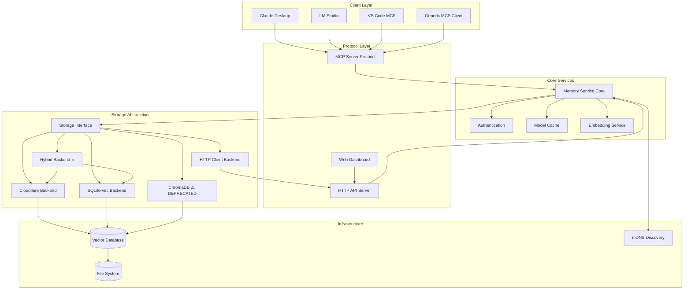

# MCP Memory Service Architecture

## Overview

MCP Memory Service is a Model Context Protocol server that provides semantic memory and persistent storage capabilities for AI assistants. It enables long-term memory storage with semantic search, time-based recall, and tag-based organization across conversations.

## System Architecture



## Core Components

### 1. Server Layer (`src/mcp_memory_service/server.py`)

The main server implementation that handles MCP protocol communication:

- **Protocol Handler**: Implements the MCP protocol specification
- **Request Router**: Routes incoming requests to appropriate handlers
- **Response Builder**: Constructs protocol-compliant responses
- **Client Detection**: Identifies and adapts to different MCP clients (Claude Desktop, LM Studio, etc.)
- **Logging System**: Client-aware logging with JSON compliance for Claude Desktop

Key responsibilities:
- Async request handling with proper error boundaries
- Global model and embedding cache management
- Lazy initialization of storage backends
- Tool registration and invocation

### 2. Storage Abstraction Layer (`src/mcp_memory_service/storage/`)

Abstract interface that allows multiple storage backend implementations:

#### Base Interface (`storage/base.py`)
```python
class MemoryStorage(ABC):
    async def initialize(self) -> None:
        """Initialize the storage backend."""
        pass

    async def store(self, memory: Memory) -> Tuple[bool, str]:
        """Store a memory object."""
        pass

    async def retrieve(self, query: str, n_results: int) -> List[MemoryQueryResult]:
        """Retrieve memories based on semantic similarity."""
        pass

    async def search_by_tag(self, tags: List[str]) -> List[Memory]:
        """Search memories by tags."""
        pass

    async def delete(self, content_hash: str) -> Tuple[bool, str]:
        """Delete a memory by content hash."""
        pass

    async def recall_memory(self, query: str, n_results: int) -> List[Memory]:
        """Recall memories using natural language time queries."""
        pass
```

#### Hybrid Backend (`storage/hybrid.py`) ⭐ **RECOMMENDED**
- **Production default** - Best performance with cloud synchronization
- **Primary storage**: SQLite-vec for ultra-fast local reads (~5ms)
- **Secondary storage**: Cloudflare for multi-device persistence and cloud backup
- **Background sync**: Zero user-facing latency with async operation queue
- **Graceful degradation**: Works offline, automatically syncs when cloud available
- **Capacity monitoring**: Tracks Cloudflare limits and provides warnings
- **Use cases**: Production deployments, multi-device users, cloud-backed local performance

#### Cloudflare Backend (`storage/cloudflare.py`)
- Cloud-native storage using Cloudflare D1 (SQL) + Vectorize (vectors)
- Global edge distribution for low-latency access worldwide
- Serverless architecture with no infrastructure management
- Automatic scaling and high availability
- **Limits**: 10GB D1 database, 5M vectors in Vectorize
- **Use cases**: Cloud-only deployments, serverless environments, no local storage

#### SQLite-vec Backend (`storage/sqlite_vec.py`)
- Lightweight, fast local storage (5ms read latency)
- Native SQLite with vec0 extension for vector similarity
- ONNX Runtime embeddings (no PyTorch dependency)
- Minimal memory footprint and dependencies
- **Use cases**: Development, single-device deployments, or as primary in Hybrid backend

#### HTTP Client Backend (`storage/http_client.py`)
- Remote storage via HTTP API for distributed architectures
- Enables client-server deployments with centralized memory
- Bearer token authentication with API key support
- Automatic retry logic with exponential backoff
- **Use cases**: Multi-client shared memory, remote MCP servers, load balancing

#### ChromaDB Backend (`storage/chroma.py`) ⚠️ **DEPRECATED**
- **Status**: Deprecated since v5.x, removal planned for v6.0.0
- **Migration path**: Switch to Hybrid backend for production
- Original vector database backend with sentence transformer embeddings
- Heavy dependencies (PyTorch, sentence-transformers, ~2GB download)
- Slower performance (15ms vs 5ms for SQLite-vec)
- Higher memory footprint and complexity
- **Why deprecated**: Hybrid backend provides better performance with cloud sync
- **Historical only**: Not recommended for new deployments

### 3. Models Layer (`src/mcp_memory_service/models/`)

Data structures and validation:

```python
@dataclass
class Memory:
    id: str
    content: str
    content_hash: str
    memory_type: str
    tags: List[str]
    metadata: MemoryMetadata
    created_at: datetime
    updated_at: datetime

@dataclass
class MemoryMetadata:
    source: Optional[str]
    client_id: Optional[str]
    session_id: Optional[str]
    parent_memory_id: Optional[str]
    child_memory_ids: List[str]
```

### 4. Web Interface (`src/mcp_memory_service/web/`)

Modern web dashboard for memory management:

- **Frontend**: Responsive React-based UI
- **API Routes**: RESTful endpoints for memory operations
- **WebSocket Support**: Real-time updates
- **Authentication**: API key-based authentication
- **Health Monitoring**: System status and metrics

### 5. Configuration Management (`src/mcp_memory_service/config.py`)

Environment-based configuration with sensible defaults:

- Storage backend selection
- Model selection and caching
- Platform-specific optimizations
- Hardware acceleration detection (CUDA, MPS, DirectML, ROCm)
- Network configuration (HTTP, HTTPS, mDNS)

## Key Design Patterns

### Async/Await Pattern
All I/O operations use Python's async/await for non-blocking execution:
```python
async def store_memory(self, content: str) -> Memory:
    embedding = await self._generate_embedding(content)
    memory = await self.storage.store(content, embedding)
    return memory
```

### Lazy Initialization
Resources are initialized only when first needed:
```python
async def _ensure_storage_initialized(self):
    if self.storage is None:
        self.storage = await create_storage_backend()
    return self.storage
```

### Global Caching Strategy
Model and embedding caches are shared globally to reduce memory usage:
```python
_MODEL_CACHE = {}
_EMBEDDING_CACHE = LRUCache(maxsize=1000)
```

### Platform Detection and Optimization
Automatic detection and optimization for different platforms:
- **macOS**: MPS acceleration for Apple Silicon
- **Windows**: CUDA or DirectML
- **Linux**: CUDA, ROCm, or CPU
- **Fallback**: ONNX Runtime for compatibility

## MCP Protocol Operations

### Core Memory Operations

| Operation | Description | Parameters |
|-----------|-------------|------------|
| `store_memory` | Store new memory with tags | content, tags, metadata |
| `retrieve_memory` | Semantic search | query, n_results |
| `recall_memory` | Time-based retrieval | time_expression, n_results |
| `search_by_tag` | Tag-based search | tags[] |
| `delete_memory` | Delete by hash | content_hash |
| `delete_by_tags` | Bulk deletion | tags[] |

### Utility Operations

| Operation | Description | Parameters |
|-----------|-------------|------------|
| `check_database_health` | Health status | - |
| `optimize_db` | Database optimization | - |
| `export_memories` | Export to JSON | output_path |
| `import_memories` | Import from JSON | input_path |
| `get_memory_stats` | Usage statistics | - |

### Debug Operations

| Operation | Description | Parameters |
|-----------|-------------|------------|
| `debug_retrieve` | Detailed similarity scores | query, n_results |
| `exact_match_retrieve` | Exact content matching | query |

## Data Flow

### Memory Storage Flow
```
1. Client sends store_memory request
2. Server validates and enriches metadata
3. Content is hashed for deduplication
4. Text is embedded using sentence transformers
5. Memory is stored in vector database
6. Confirmation returned to client
```

### Memory Retrieval Flow
```
1. Client sends retrieve_memory request
2. Query is embedded to vector representation
3. Vector similarity search performed
4. Results ranked by similarity score
5. Metadata enriched results returned
```

### Time-Based Recall Flow
```
1. Client sends recall_memory with time expression
2. Time parser extracts temporal boundaries
3. Semantic query combined with time filter
4. Filtered results returned chronologically
```

## Performance Optimizations

### Model Caching
- Sentence transformer models cached globally
- Single model instance shared across requests
- Lazy loading on first use

### Embedding Cache
- LRU cache for frequently used embeddings
- Configurable cache size
- Cache hit tracking for optimization

### Query Optimization
- Batch processing for multiple operations
- Connection pooling for database access
- Async I/O for non-blocking operations

### Platform-Specific Optimizations
- Hardware acceleration auto-detection
- Optimized tensor operations per platform
- Fallback strategies for compatibility

## Security Considerations

### Authentication
- API key-based authentication for HTTP endpoints
- Bearer token support
- Per-client authentication in multi-client mode

### Data Privacy
- Content hashing for deduplication
- Optional encryption at rest
- Client isolation in shared deployments

### Network Security
- HTTPS support with SSL/TLS
- CORS configuration for web access
- Rate limiting for API endpoints

## Deployment Architectures

### Production (Hybrid Backend) ⭐ **RECOMMENDED**
- **Local performance**: SQLite-vec for 5ms read latency
- **Cloud persistence**: Cloudflare for multi-device sync and backup
- **Background sync**: Zero user-facing latency, async operation queue
- **Offline capability**: Full functionality without internet, syncs when available
- **Multi-device**: Access same memories across desktop, laptop, mobile
- **Use cases**: Individual users, teams with personal instances, production deployments
- **Setup**: `install.py --storage-backend hybrid` or set `MCP_MEMORY_STORAGE_BACKEND=hybrid`

### Cloud-Only (Cloudflare Backend)
- **Serverless deployment**: No local storage, pure cloud architecture
- **Global edge**: Cloudflare's worldwide network for low latency
- **Automatic scaling**: Handles traffic spikes without configuration
- **Use cases**: Serverless environments, ephemeral containers, CI/CD systems
- **Limits**: 10GB D1 database, 5M vectors in Vectorize
- **Setup**: `install.py --storage-backend cloudflare` or set `MCP_MEMORY_STORAGE_BACKEND=cloudflare`

### Development (SQLite-vec Backend)
- **Lightweight**: Minimal dependencies, fast startup
- **Local-only**: No cloud connectivity required
- **Fast iteration**: 5ms read latency, no sync overhead
- **Use cases**: Development, testing, single-device prototypes
- **Setup**: `install.py --storage-backend sqlite_vec` or set `MCP_MEMORY_STORAGE_BACKEND=sqlite_vec`

### Multi-Client Shared (HTTP Server)
- **Centralized HTTP server** with shared memory pool
- **Multiple clients** connect via API (Claude Desktop, VS Code, custom apps)
- **Authentication**: API key-based access control
- **Use cases**: Team collaboration, shared organizational memory
- **Setup**: Enable HTTP server with `MCP_HTTP_ENABLED=true`, clients use HTTP Client backend

### Legacy (ChromaDB Backend) ⚠️ **NOT RECOMMENDED**
- **Deprecated**: Removal planned for v6.0.0
- **Migration required**: Switch to Hybrid backend
- Heavy dependencies, slower performance (15ms vs 5ms)
- Only for existing deployments with migration path to Hybrid

## Extension Points

### Custom Storage Backends
Implement the `MemoryStorage` abstract base class:
```python
class CustomStorage(MemoryStorage):
    async def store(self, memory: Memory) -> Tuple[bool, str]:
        # Custom implementation
```

### Custom Embedding Models
Replace the default sentence transformer:
```python
EMBEDDING_MODEL = "your-model/name"
```

### Protocol Extensions
Add new operations via tool registration:
```python
types.Tool(
    name="custom_operation",
    description="Custom memory operation",
    inputSchema={
        "type": "object",
        "properties": {
            "param1": {
                "type": "string",
                "description": "First parameter"
            },
            "param2": {
                "type": "integer",
                "description": "Second parameter",
                "default": 0
            }
        },
        "required": ["param1"],
        "additionalProperties": false
    }
)
```

## Future Enhancements

### Planned Features (See Issue #91)
- **WFGY Semantic Firewall** - Enhanced memory reliability with 16 failure mode detection/recovery
- **Ontology Foundation Layer** (Phase 0) - Controlled vocabulary, taxonomy, knowledge graph
- Automatic memory consolidation
- Semantic clustering
- Memory importance scoring
- Cross-conversation threading

### Under Consideration
- **Agentic RAG** for intelligent retrieval (see Discussion #86)
- **Graph-based memory relationships** (ontology pipeline integration)
- Memory compression strategies
- Federated learning from memories
- Real-time collaboration features
- Advanced visualization tools

## References

- [MCP Protocol Specification](https://modelcontextprotocol.io/docs)
- [ChromaDB Documentation](https://docs.trychroma.com/)
- [SQLite Vec Extension](https://github.com/asg017/sqlite-vec)
- [Sentence Transformers](https://www.sbert.net/)